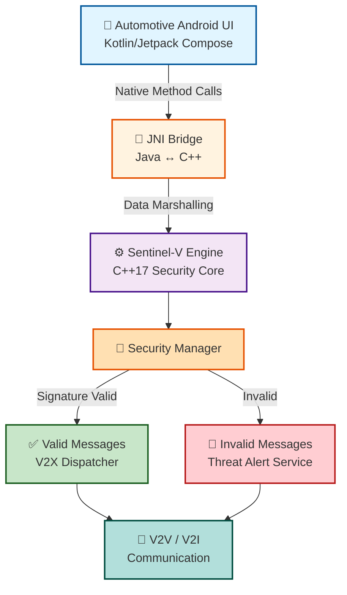
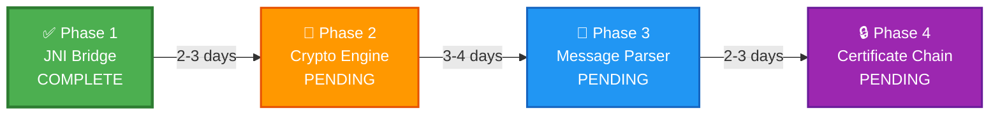
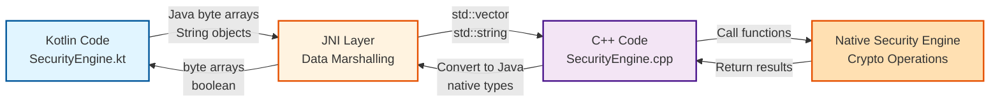
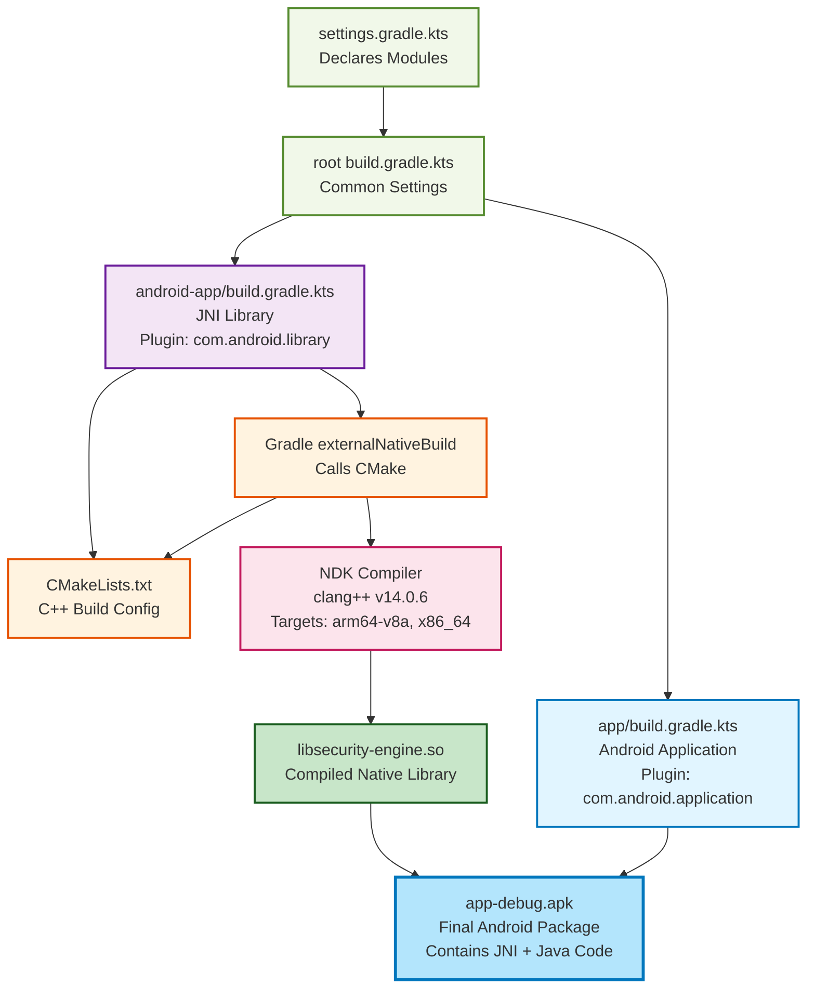
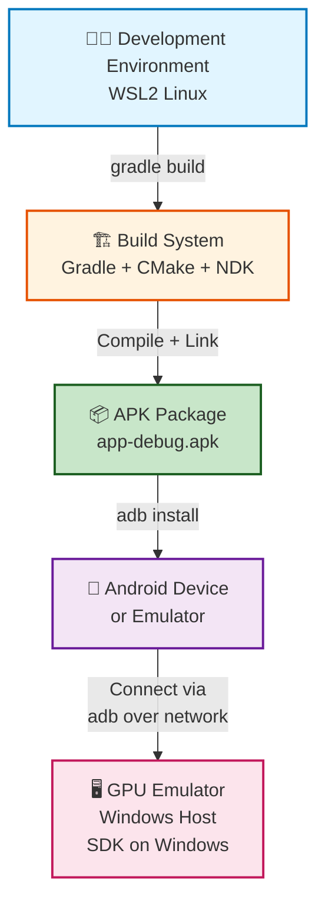
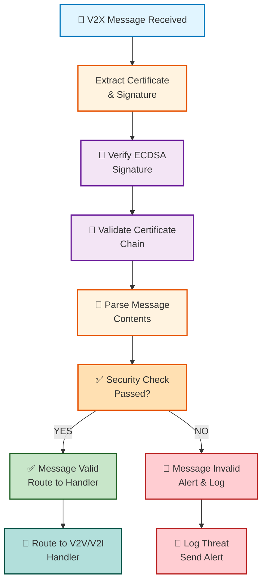
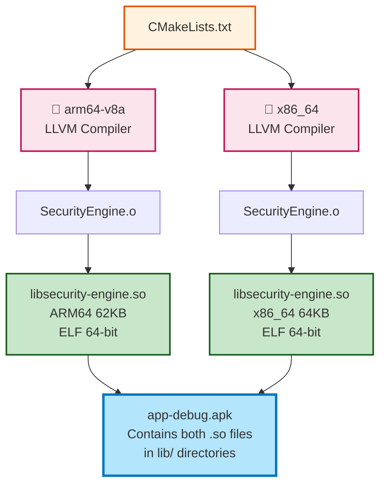

# Sentinel-V Architecture Diagrams

This document contains visual diagrams in Mermaid format for the project architecture. For universal markdown compatibility, see the ASCII diagrams in [README.md](README.md).

> **Note**: These diagrams render best in:
> - GitHub (web interface)
> - VS Code with Markdown Preview Enhanced extension
> - Online Mermaid viewers (mermaid.live)

---

## 🏗️ Architecture Overview

**Flow Description:**
1. **UI Layer** (Kotlin) initiates security operations
2. **JNI Bridge** marshals data between Java and C++
3. **Security Engine** performs cryptographic validation
4. **Validation Result** routes to appropriate handler
5. **Communication Layer** sends/receives V2X messages

---

## 📋 Project Structure

```mermaid
graph TD
    Root["sentinel-v-v2x-bridge<br/>(Root Project)"]
    
    Root --> App["📦 app/<br/>Main Android Application"]
    Root --> AndroidApp["🌉 android-app/<br/>JNI Bridge Module"]
    Root --> NativeEngine["🔐 native-engine/<br/>Crypto Engine Phase 2"]
    Root --> Docs["📚 docs/<br/>Documentation"]
    Root --> Config["⚙️ Build Configuration"]
    
    App --> AppMani["AndroidManifest.xml"]
    App --> AppKotlin["kotlin/<br/>Activities & Services"]
    App --> AppRes["res/<br/>Layout, Strings, Drawables"]
    
    AndroidApp --> AndroidJNI["SecurityEngine.kt<br/>JNI Interface 6 methods"]
    AndroidApp --> AndroidCPP["SecurityEngine.cpp<br/>C++ Implementation 310 LOC"]
    AndroidApp --> AndroidCMake["CMakeLists.txt<br/>CMake Configuration"]
    AndroidApp --> AndroidLib["libsecurity-engine.so<br/>Native Libraries arm64-v8a x86_64"]
    
    NativeEngine --> EngineInc["include/<br/>Crypto Headers TBD"]
    NativeEngine --> EngineSrc["src/<br/>Implementation TBD"]
    NativeEngine --> EngineTests["tests/<br/>Unit Tests TBD"]
    
    Docs --> DocDetail["Project-Details.md<br/>Technical Specification"]
    Docs --> DocDir["DIRECTORY-STRUCTURE-GUIDE.md<br/>Folder Organization"]
    Docs --> DocPhase["PHASE-1-SESSION-SUMMARY.md<br/>Implementation Details"]
    
    Config --> ConfigRoot["build.gradle.kts<br/>Root Configuration"]
    Config --> ConfigSettings["settings.gradle.kts<br/>Module Declarations"]
    Config --> ConfigProps["gradle.properties<br/>Gradle Properties"]
    Config --> ConfigLocal["local.properties<br/>SDK NDK Paths"]
    
    style Root fill:#e3f2fd,stroke:#1976d2,stroke-width:3px
    style App fill:#e1f5ff,stroke:#0277bd,stroke-width:2px
    style AndroidApp fill:#f3e5f5,stroke:#6a1b9a,stroke-width:2px
    style NativeEngine fill:#ffe0b2,stroke:#e65100,stroke-width:2px
    style Docs fill:#fce4ec,stroke:#c2185b,stroke-width:2px
    style Config fill:#f1f8e9,stroke:#558b2f,stroke-width:2px
```

**Module Purpose:**
- **app**: Runnable Android application (creates APK)
- **android-app**: JNI library module (creates AAR)
- **native-engine**: Standalone crypto library (Phase 2)
- **docs**: Project documentation
- **config**: Gradle build configuration

---

## 📈 Development Phases Timeline

### Phase Timeline Details

**Phase 1: JNI Bridge** ✅
- Duration: 2-3 days
- Status: Complete (Commit: b4cd545)
- Deliverables:
  - Kotlin SecurityEngine.kt (6 external methods)
  - C++ SecurityEngine.cpp (310 LOC JNI implementation)
  - CMake build configuration
  - Gradle integration with externalNativeBuild
  - Native compilation for arm64-v8a and x86_64
  - Build artifacts: libsecurity-engine.so (62KB + 64KB)

**Phase 2: Crypto Engine** ⏳
- Duration: 3-4 days (estimated)
- Dependencies: Phase 1 complete
- Key Tasks:
  - Implement ECDSA signature verification
  - Implement SHA-256 hashing
  - Implement X.509 certificate parsing
  - Integrate Botan or OpenSSL library
  - Update CMakeLists.txt for crypto linkage

**Phase 3: V2X Message Parser** ⏳
- Duration: 2-3 days (estimated)
- Dependencies: Phase 2 complete
- Key Tasks:
  - IEEE 1609.2 message decoding
  - Header extraction and validation
  - Payload parsing and interpretation

**Phase 4: Certificate Chain Validation** ⏳
- Duration: 2-3 days (estimated)
- Dependencies: Phases 2 & 3 complete
- Key Tasks:
  - Certificate expiration checking
  - Full chain validation
  - Revocation list support

---

## 🔄 JNI Bridge Data Flow

### JNI Functions (6 total)

| Function | Kotlin Signature | C++ Implementation |
|----------|------------------|-------------------|
| `verifyPacket()` | `(ByteArray, ByteArray, Array<ByteArray>) → Boolean` | `Java_com_sentinel_v2x_bridge_SecurityEngine_verifyPacket` |
| `extractSenderInfo()` | `(ByteArray) → String` | `Java_com_sentinel_v2x_bridge_SecurityEngine_extractSenderInfo` |
| `initializeWithRootCA()` | `(ByteArray) → Boolean` | `Java_com_sentinel_v2x_bridge_SecurityEngine_initializeWithRootCA` |
| `validateCertificateChain()` | `(Array<ByteArray>) → Boolean` | `Java_com_sentinel_v2x_bridge_SecurityEngine_validateCertificateChain` |
| `parseIEEE1609Message()` | `(ByteArray) → Array<String>` | `Java_com_sentinel_v2x_bridge_SecurityEngine_parseIEEE1609Message` |
| `cleanup()` | `() → Unit` | `Java_com_sentinel_v2x_bridge_SecurityEngine_cleanup` |

---

## 🔨 Build System Architecture

**Build Pipeline:**
1. Gradle reads module structure
2. Applies common build settings
3. Configures JNI library module with CMake
4. Invokes CMake during build
5. CMake calls NDK C++ compiler
6. Compiles SecurityEngine.cpp for multiple ABIs
7. Links against Android system libraries
8. Produces libsecurity-engine.so binaries
9. Packages into final APK

---

## 🌍 Deployment Architecture

**Hybrid Setup Rationale:**
- **WSL2 Linux**: Hosts NDK (Linux prebuilts required for native compilation)
- **Windows Host**: Hosts SDK (GPU acceleration for Android Emulator)
- **Result**: Optimal performance for both compilation and testing

---

## 🔐 Security Flow Diagram

---

## 📊 Multi-Architecture Compilation

**Compilation Details:**
- **CMake Generator**: Ninja (via NDK)
- **Compiler**: Android LLVM 14.0.6 (clang++)
- **C++ Standard**: C++17 with std:: library
- **Android STL**: c++_shared
- **Optimization**: Default (debug symbols included)
- **Compiler Flags**: -Wall -Wextra -Wpedantic -fPIC

---

## 📞 View Options

| Format | Location | Best For | Rendering |
|--------|----------|----------|-----------|
| **ASCII Diagrams** | [README.md](../README.md) | Universal compatibility | Any markdown viewer |
| **Mermaid Diagrams** | This file (docs/ARCHITECTURE-DIAGRAMS.md) | Rich visualization | GitHub, VS Code with extension |
| **Detailed Structure** | [DIRECTORY-STRUCTURE-GUIDE.md](../DIRECTORY-STRUCTURE-GUIDE.md) | Text-based documentation | Any text editor |

**Recommended Viewers for This File:**
- GitHub Web Interface (native Mermaid support)
- VS Code + Markdown Preview Enhanced extension
- Online: [mermaid.live](https://mermaid.live)
- GitLab, Gitea, Gitpod (Mermaid support)

---

**Last Updated**: March 7, 2026  
**Phase**: 1/4 Complete
