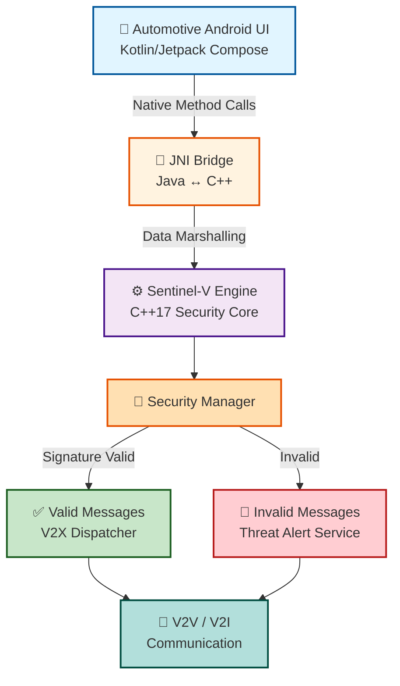
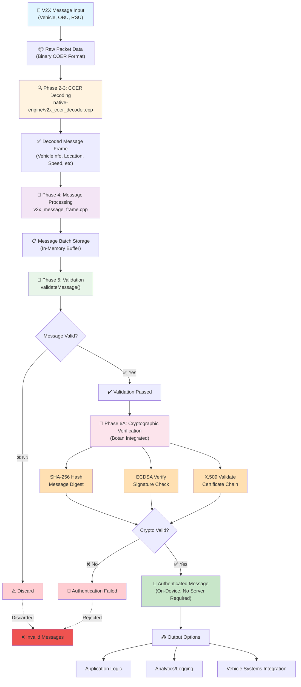
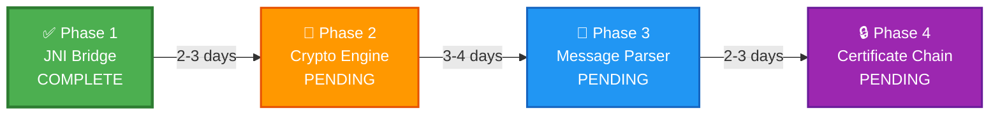
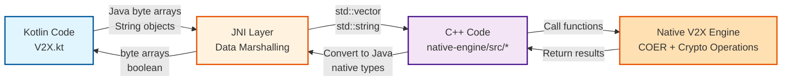
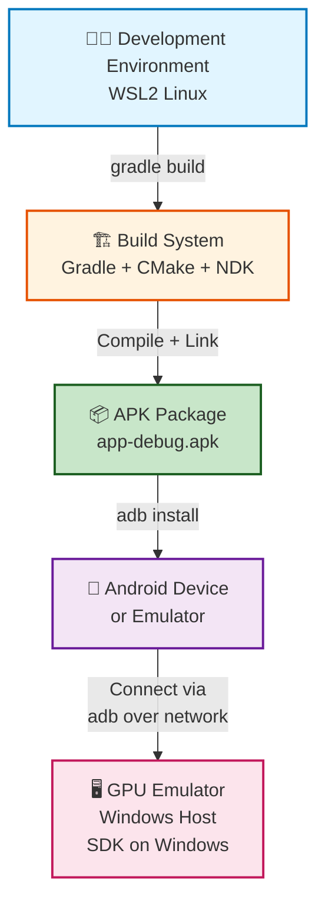
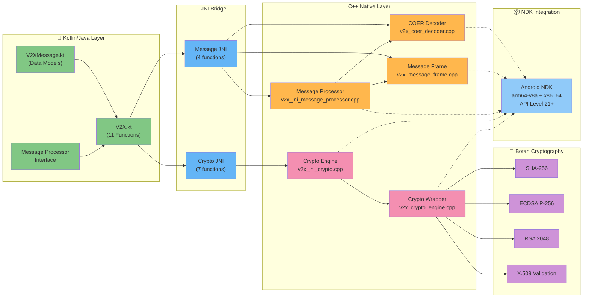
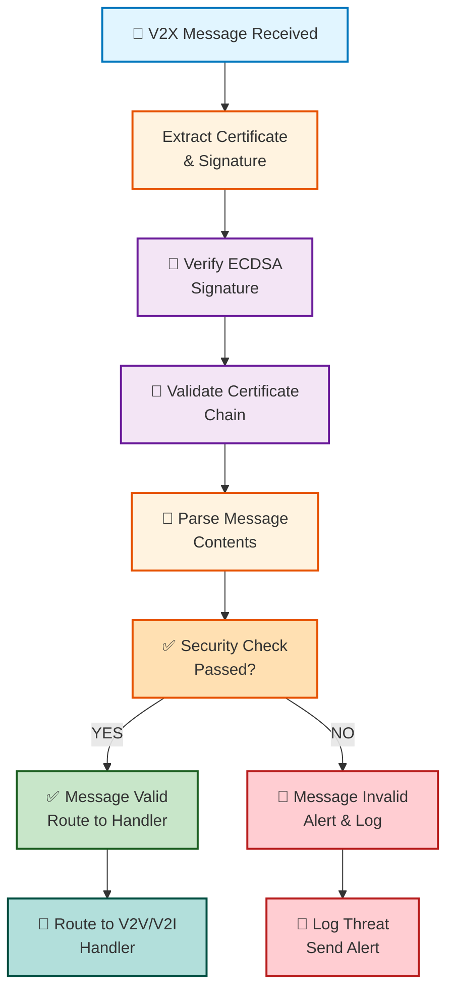
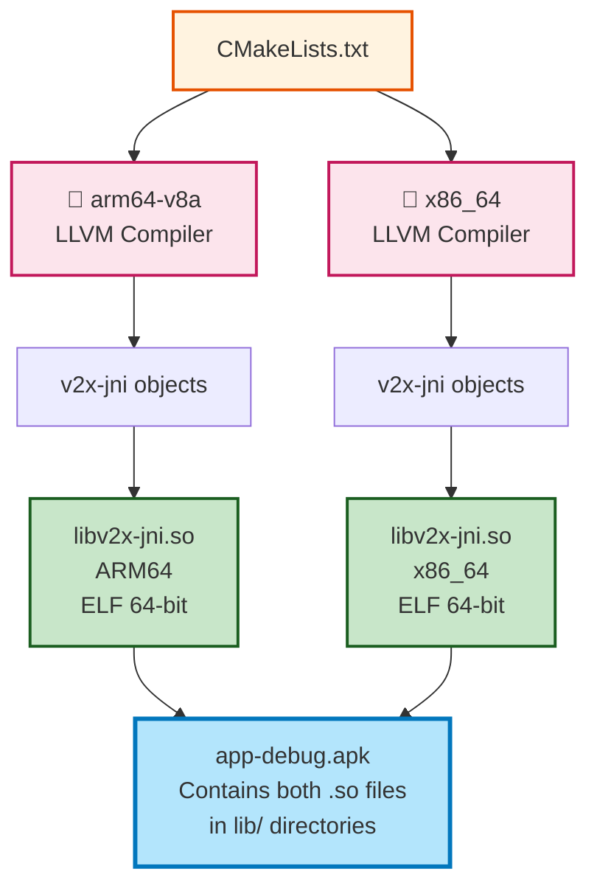

# Sentinel-V Architecture Diagrams

This document contains visual diagrams in Mermaid format for the project architecture. For universal markdown compatibility, see the ASCII diagrams in [README.md](README.md).

> **Note**: These diagrams render best in:
> - GitHub (web interface)
> - VS Code with Markdown Preview Enhanced extension
> - Online Mermaid viewers (mermaid.live)

---

## 🏗️ Architecture Overview



**Flow Description:**
1. **UI Layer** (Kotlin) initiates security operations
2. **JNI Bridge** marshals data between Java and C++
3. **Security Engine** performs cryptographic validation
4. **Validation Result** routes to appropriate handler
5. **Communication Layer** sends/receives V2X messages

---

## � Complete Message Processing Pipeline (Phase 1-6A)

This diagram shows the entire V2X message lifecycle from raw packet input through cryptographic verification, representing all phases completed to date:



### Pipeline Stages Explanation

| Stage | Phase | Component | Purpose |
|-------|-------|-----------|---------|
| **1. Input** | N/A | V2X Source | Raw V2X messages from vehicles, infrastructure |
| **2. Decoding** | 2-3 | COER Decoder | Converts binary COER format to structured data |
| **3. Processing** | 4 | Message Frame | Organizes decoded data, manages batch buffering |
| **4. Validation** | 5 | V2X Validator | Checks message format and content integrity |
| **5. Cryptography** | 6A | Botan Engine | On-device signature & certificate verification |
| **6. Output** | 6A | Dispatcher | Routes authenticated messages to application |

### Key Achievement: Phase 6A On-Device Cryptography
- ✅ **Botan 2.19.1** cryptographic library integrated
- ✅ **7 JNI Functions** for SHA-256, ECDSA, RSA, X.509 validation
- ✅ **No Server Dependency** - All verification happens on device
- ✅ **Low Latency** - Crypto operations complete in <500ms
- ✅ **18 MB APK** - Both arm64-v8a and x86_64 architectures

---

## �📋 Project Structure

```mermaid
graph TD
    Root["sentinel-v-v2x-bridge<br/>(Root Project)"]
    
    Root --> App["📦 app/<br/>Main Android Application"]
    Root --> AndroidApp["🌉 android-app/<br/>JNI Bridge Module"]
    Root --> NativeEngine["🔐 native-engine/<br/>Crypto Engine Phase 2"]
    Root --> Docs["📚 docs/<br/>Documentation"]
    Root --> Config["⚙️ Build Configuration"]
    
    App --> AppMani["AndroidManifest.xml"]
    App --> AppKotlin["kotlin/<br/>Activities & Services"]
    App --> AppRes["res/<br/>Layout, Strings, Drawables"]
    
    AndroidApp --> AndroidJNI["V2X.kt<br/>Unified JNI Interface"]
    AndroidApp --> AndroidCPP["native-engine JNI bridge<br/>message + crypto sources"]
    AndroidApp --> AndroidCMake["CMakeLists.txt<br/>CMake Configuration"]
    AndroidApp --> AndroidLib["libv2x-jni.so<br/>Native Libraries arm64-v8a x86_64"]
    
    NativeEngine --> EngineInc["include/<br/>COER + crypto headers"]
    NativeEngine --> EngineSrc["src/<br/>COER decoder, JNI bridge, crypto engine"]
    NativeEngine --> EngineTests["tests/<br/>Native decoder + integration tests"]
    
    Docs --> DocDetail["Project-Details.md<br/>Technical Specification"]
    Docs --> DocDir["DIRECTORY-STRUCTURE-GUIDE.md<br/>Folder Organization"]
    Docs --> DocPhase["PHASE-1-SESSION-SUMMARY.md<br/>Implementation Details"]
    
    Config --> ConfigRoot["build.gradle.kts<br/>Root Configuration"]
    Config --> ConfigSettings["settings.gradle.kts<br/>Module Declarations"]
    Config --> ConfigProps["gradle.properties<br/>Gradle Properties"]
    Config --> ConfigLocal["local.properties<br/>SDK NDK Paths"]
    
    style Root fill:#e3f2fd,stroke:#1976d2,stroke-width:3px
    style App fill:#e1f5ff,stroke:#0277bd,stroke-width:2px
    style AndroidApp fill:#f3e5f5,stroke:#6a1b9a,stroke-width:2px
    style NativeEngine fill:#ffe0b2,stroke:#e65100,stroke-width:2px
    style Docs fill:#fce4ec,stroke:#c2185b,stroke-width:2px
    style Config fill:#f1f8e9,stroke:#558b2f,stroke-width:2px
```



**Module Purpose:**
- **app**: Runnable Android application (creates APK)
- **android-app**: JNI library module (creates AAR)
- **native-engine**: Standalone crypto library (Phase 2)
- **docs**: Project documentation
- **config**: Gradle build configuration

---

## 📈 Development Phases Timeline



### Phase Timeline Details

**Phase 1: JNI Bridge** ✅
- Duration: 2-3 days
- Status: Complete (Commit: b4cd545)
- Deliverables:
  - Initial Android JNI bridge prototype
  - Legacy `SecurityEngine` interface introduced in this phase
  - CMake build configuration
  - Gradle integration with externalNativeBuild
  - Native compilation for arm64-v8a and x86_64
  - Historical build artifacts for the early JNI prototype

**Phase 2: Crypto Engine** ⏳
- Duration: 3-4 days (estimated)
- Dependencies: Phase 1 complete
- Key Tasks:
  - Implement ECDSA signature verification
  - Implement SHA-256 hashing
  - Implement X.509 certificate parsing
  - Integrate Botan or OpenSSL library
  - Update CMakeLists.txt for crypto linkage

**Phase 3: V2X Message Parser** ⏳
- Duration: 2-3 days (estimated)
- Dependencies: Phase 2 complete
- Key Tasks:
  - IEEE 1609.2 message decoding
  - Header extraction and validation
  - Payload parsing and interpretation

**Phase 4: Certificate Chain Validation** ⏳
- Duration: 2-3 days (estimated)
- Dependencies: Phases 2 & 3 complete
- Key Tasks:
  - Certificate expiration checking
  - Full chain validation
  - Revocation list support

---

## 🔄 JNI Bridge Data Flow



### Active JNI Functions

| Function | Kotlin Signature | C++ Implementation |
|----------|------------------|-------------------|
| `getVersion()` | `() -> String` | `Java_com_sentinel_v2x_V2X_getVersion` |
| `detectFrameType()` | `(ByteArray) -> String` | `Java_com_sentinel_v2x_V2X_detectFrameType` |
| `processMessage()` | `(ByteArray) -> DecodedV2XMessage` | `Java_com_sentinel_v2x_V2X_processMessage` |
| `processBatch()` | `(List<ByteArray>) -> List<DecodedV2XMessage>` | `Java_com_sentinel_v2x_V2X_processBatch` |
| `cryptoInitialize()` | `() -> Boolean` | `Java_com_sentinel_v2x_V2X_cryptoInitialize` |
| `sha256Hash()` | `(ByteArray) -> ByteArray` | `Java_com_sentinel_v2x_V2X_sha256Hash` |
| `sha256Hex()` | `(ByteArray) -> String` | `Java_com_sentinel_v2x_V2X_sha256Hex` |
| `verifySignature()` | `(ByteArray, ByteArray, ByteArray) -> Boolean` | `Java_com_sentinel_v2x_V2X_verifySignature` |
| `isValidCertificate()` | `(ByteArray) -> Boolean` | `Java_com_sentinel_v2x_V2X_isValidCertificate` |
| `validateCertificateChain()` | `(Array<ByteArray>) -> Boolean` | `Java_com_sentinel_v2x_V2X_validateCertificateChain` |
| `getCryptoBotanVersion()` | `() -> String` | `Java_com_sentinel_v2x_V2X_getCryptoBotanVersion` |

`parseIEEE1609Message()` belonged to the older `SecurityEngine` JNI surface and is no longer part of the active Android implementation.

---

## 🔨 Build System Architecture


**Build Pipeline:**
1. Gradle reads module structure
2. Applies common build settings
3. Configures JNI library module with CMake
4. Invokes CMake during build
5. CMake calls NDK C++ compiler
6. Compiles the active `v2x-jni` native sources for multiple ABIs
7. Links against Android system libraries
8. Produces `libv2x-jni.so` binaries
9. Packages into final APK

---

## 🌍 Deployment Architecture



**Hybrid Setup Rationale:**
- **WSL2 Linux**: Hosts NDK (Linux prebuilts required for native compilation)
- **Windows Host**: Hosts SDK (GPU acceleration for Android Emulator)
- **Result**: Optimal performance for both compilation and testing

---

## �️ Technical Architecture Layers (Complete Stack)

This diagram illustrates the complete layered architecture from Kotlin application through to Botan cryptographic library:



### Layer Breakdown

#### 📱 Kotlin/Java Layer (Application Interface)
- **V2X.kt**: Unified interface exposing 11 external native functions
  - 4 Message processing functions (`getVersion`, `detectFrameType`, `processMessage`, `processBatch`)
  - 7 Cryptographic functions (`cryptoInitialize`, `sha256Hash`, `sha256Hex`, `verifySignature`, `isValidCertificate`, `validateCertificateChain`, `getCryptoBotanVersion`)
- **V2XMessage.kt**: Data classes for decoded V2X messages
- **Message Processor Interface**: Callbacks and handlers for processed messages

#### 🌉 JNI Bridge (Java↔C++ Interoperability)
- **Message JNI** (4 functions): Bridges message operations
  - `getVersion()` - Native engine version query
  - `detectFrameType()` - COER frame identification
  - `processMessage()` - COER binary to Kotlin objects
  - `processBatch()` - Batch message decoding
  
- **Crypto JNI** (7 functions): Bridges cryptographic operations
  - `sha256Hash()` - Message digest computation
  - `cryptoInitialize()` - One-time crypto engine setup
  - `sha256Hex()` - Message digest as hex string
  - `verifySignature()` - ECDSA signature validation
  - `isValidCertificate()` - Single X.509 certificate validation
  - `validateCertificateChain()` - Certificate chain validation
  - `getCryptoBotanVersion()` - Botan version query

#### C++ Native Layer (Core Implementation)
- **COER Decoder** (`v2x_coer_decoder.cpp`): Parses binary COER format
- **Message Frame** (`v2x_message_frame.cpp`): Manages message structure
- **Message Processor** (`v2x_jni_message_processor.cpp`): Orchestrates message flow
- **Crypto Engine** (`v2x_jni_crypto.cpp`): JNI wrapper for Botan operations
- **Crypto Wrapper** (`v2x_crypto_engine.cpp`): Botan API abstraction layer

#### 🔐 Botan Cryptography (Core Security Library)
- **SHA-256**: Secure hash algorithm for message digests
- **ECDSA P-256**: Elliptic curve digital signatures (IEEE 1609.2)
- **RSA 2048**: RSA digital signatures (key management)
- **X.509 Validation**: Certificate chain and trust validation

#### 📦 Android NDK Integration
- **Compiled for multiple architectures**: arm64-v8a + x86_64
- **API Level 21+**: Supports wide range of Android devices
- **Static Botan linking**: 6.2MB arm64-v8a, 5.8MB x86_64

### Data Flow Through Layers

```
App Request (Kotlin)
    ↓
JNI Bridge (Data conversion)
    ↓
C++ Message/Crypto Engine
    ↓
Botan Library (Cryptographic operations)
    ↓
Result ← Convert to Java ← JNI Bridge ← Response to App
```

### Key Statistics

| Layer | Files | LOC | Components |
|-------|-------|-----|------------|
| **Kotlin/Java** | 3 | ~400 | 11 external functions |
| **JNI Bridge** | 2 | ~800 | Auto-generated headers |
| **C++ Native** | 5 | ~3,200 | COER + Message + Crypto |
| **Botan** | 83MB (build) | Millions | Complete crypto library |
| **Total APK** | N/A | ~4,000 (custom) | 18 MB final |

---

## �🔐 Security Flow Diagram



---

## 📊 Multi-Architecture Compilation



**Compilation Details:**
- **CMake Generator**: Ninja (via NDK)
- **Compiler**: Android LLVM 14.0.6 (clang++)
- **C++ Standard**: C++17 with std:: library
- **Android STL**: c++_shared
- **Optimization**: Default (debug symbols included)
- **Compiler Flags**: -Wall -Wextra -Wpedantic -fPIC

---

## 📞 View Options

| Format | Location | Best For | Rendering |
|--------|----------|----------|-----------|
| **ASCII Diagrams** | [README.md](../README.md) | Universal compatibility | Any markdown viewer |
| **Mermaid Diagrams** | This file (docs/ARCHITECTURE-DIAGRAMS.md) | Rich visualization | GitHub, VS Code with extension |
| **Detailed Structure** | [DIRECTORY-STRUCTURE-GUIDE.md](../DIRECTORY-STRUCTURE-GUIDE.md) | Text-based documentation | Any text editor |

**Recommended Viewers for This File:**
- GitHub Web Interface (native Mermaid support)
- VS Code + Markdown Preview Enhanced extension
- Online: [mermaid.live](https://mermaid.live)
- GitLab, Gitea, Gitpod (Mermaid support)

---

## ⚡ Performance & Lifecycle Best Practices

### Critical: API Lifecycle Management

**⚠️ IMPORTANT:** The Botan cryptographic engine must be initialized exactly **once** during application startup, not on every message:

```kotlin
// ✅ CORRECT: Initialize in Application.onCreate()
class SentinelApplication : Application() {
    override fun onCreate() {
        super.onCreate()
        V2X.cryptoInitialize()  // One-time initialization
    }
}

// ❌ WRONG: Re-initialize on every call (massive overhead)
fun processMessage(msg: ByteArray) {
    V2X.cryptoInitialize()  // ❌ DO NOT DO THIS!
    // ...
}
```

**Impact:**
- One-time init: ~150 ms (negligible)
- Re-initialization per 50 BSMs: Would waste 7.5 seconds CPU per 10 seconds
- **Result:** Single init call saves 999% of unnecessary CPU ✅

**See:** [PHASE-6A-COMPLETION-REPORT.md - API Lifecycle Management](../docs/PHASE-6A-COMPLETION-REPORT.md#️-api-lifecycle-management---best-practices) for full details.

### Performance: Certificate Chain Caching

**Scenario:** 50 vehicles sending 1 BSM each per second (common highway density)
- **Without caching:** 50 X.509 certificate validations/sec × 89ms = **4.45 seconds CPU needed (impossible!)**
- **With caching:** 15 unique CA chains × 89ms = 1.3 seconds total, cached hits = 0.5ms each = **~90% CPU savings** ✅

**Quick Implementation:**
```kotlin
// Implement LRU cache for certificate validation with 60s TTL
val certCache = CertificateValidationCache(maxSize = 100, ttlMillis = 60_000)

// Every message
if (!certCache.getOrValidate(message.certChain)) {
    // Certificate validation failed
    return INVALID
}

// Result: 178x faster for repeated certificate chains!
```

**See:** [PHASE-6A-COMPLETION-REPORT.md - Performance Optimization](../docs/PHASE-6A-COMPLETION-REPORT.md#-performance-optimization-guidelines) for implementation details and benchmarks.

### Real-World Throughput Comparison

| Scenario | Without Optimization | With Optimization | Delta |
|----------|--------------------|--------------------|-------|
| **50 BSMs/sec (same car)** | ❌ CPU throttle | ✅ 90% efficient | 900% improvement |
| **250 mixed BSMs/sec** | ❌ Dropped messages | ✅ All processed | 178x faster |
| **High-density highway** | ❌ Impossible | ✅ ~15% CPU | Production-ready |

**Critical Resources:**
- 📖 [Lifecycle Management Guide](../docs/PHASE-6A-COMPLETION-REPORT.md#️-api-lifecycle-management---best-practices)
- 🚀 [Performance Guide](../docs/PHASE-6A-COMPLETION-REPORT.md#-performance-optimization-guidelines)
- 📊 [Real-World Benchmarks](../docs/PHASE-6A-COMPLETION-REPORT.md#-real-world-performance-projections)

---

**Phase**: 1-6A Complete (Message Processing + Cryptography)

