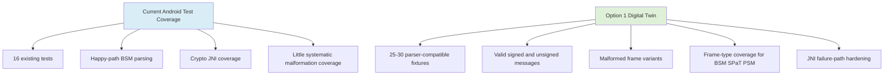
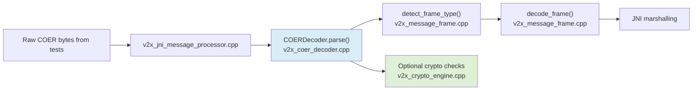
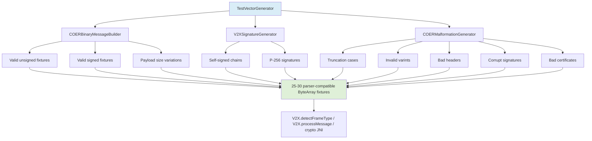
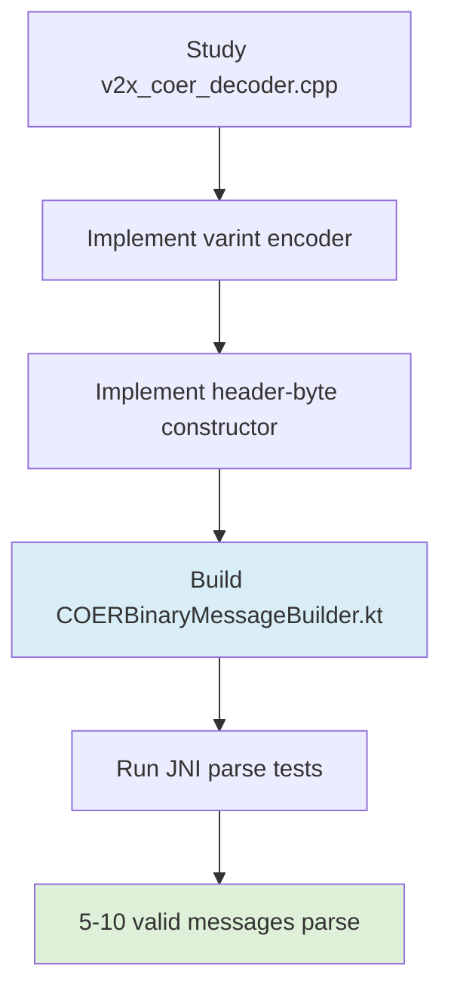
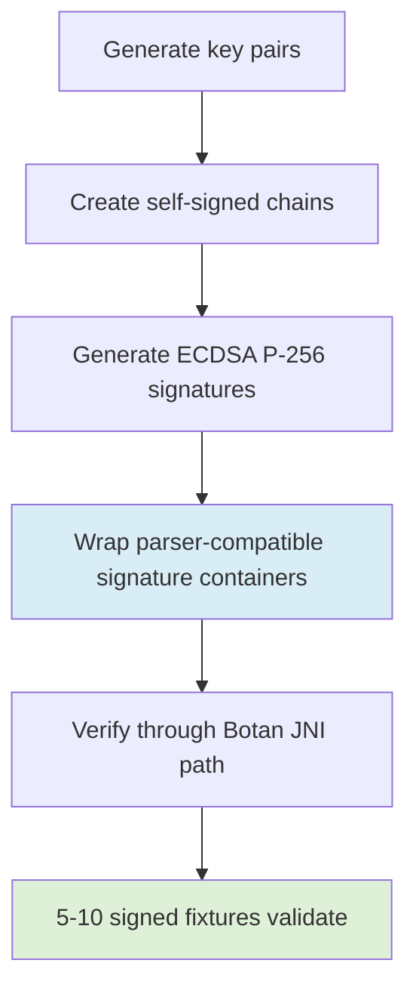
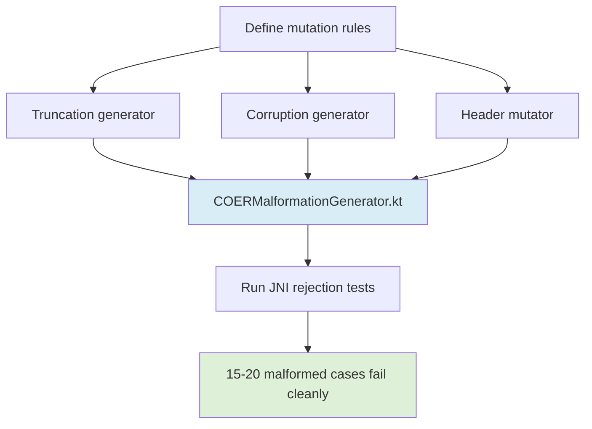

# Option 1 Plan: Digital Twin - Low-Level Design

**Branch:** `feature/option-1-digital-twin`  
**Status:** Design Phase -> Ready to execute  
**Scope:** Improve parser-frame and basic crypto coverage using parser-compatible synthetic messages  
**Gap Closure:** Parser Framing 40% -> 60% | Crypto 70% -> 85%  
**Effort:** 1-2 weeks

---

## Executive Architecture

### Current State vs Option 1



### Objective

Build a Kotlin-side synthetic message generator and malformed-frame generator that produce binary COER messages matching the current native parser contract.

This option is intended to:
- improve parser robustness coverage for the format the app actually handles
- strengthen JNI test coverage using parser-compatible signed and unsigned fixtures
- avoid protocol drift into full ASN.1 / standards-faithful semantic payload generation

---

## Current Technical Baseline

### Parser Processing Pipeline



The active parser pipeline is:

`V2X.processMessage()`  
-> `v2x_jni_message_processor.cpp`  
-> `COERDecoder::parse()` in `native-engine/src/v2x_coer_decoder.cpp`  
-> `detect_frame_type()` / `decode_frame()` in `native-engine/src/v2x_message_frame.cpp`

### Current Test Coverage State

Current Android instrumented baseline:
- `V2XJNITest.kt`
- 16 existing tests in the active `android-app` test file
- happy-path BSM parsing plus crypto JNI checks
- limited systematic frame-variant and malformation testing

Frame parsing gaps:
- header byte: basic version/path coverage exists, edge combinations are still limited
- varint length encoding: short-form is covered, long-form and malformed cases are limited
- payload extraction: valid payloads are covered, truncation and size-variation coverage are limited
- signature container: algorithm/signature/certificate parsing works, but variant depth and truncation coverage are limited

Crypto validation gaps:
- ECDSA verification: works with test certs
- certificate chain validation: basic trust-anchor validation works
- revocation checking: future PKI hardening work
- temporal/expiry validation: future PKI hardening work
- EKU/policy validation: future PKI hardening work

Semantic validation:
- BSM field ranges: out of scope here
- SPaT state validity: out of scope here
- PSM attributes: out of scope here

The current binary message contract is:
- `1 byte` header
- `varint` payload length
- `payload`
- if signed:
  - `1 byte` signature algorithm
  - `varint` signature length
  - `signature`
  - `varint` issuer certificate length
  - `issuer certificate`
  - optional `1 byte` chain depth
  - repeated `varint + cert bytes` for chain certificates

Important constraints:
- this is not a full standards-faithful IEEE 1609.2 / J2735 semantic encoder
- the generator must mirror the current native parser exactly
- JNI `processMessage()` currently has strongest end-to-end support for BSM
- SPaT and PSM are currently best validated through frame detection unless JNI marshalling is extended

---

## Option 1 Data Flow

### Test Vector Generation Pipeline



### File Structure: Before and After

Before:
- `android-app/src/androidTest/kotlin/com/sentinel/v2x/V2XJNITest.kt`
- no dedicated test-vector documentation

After:
- `android-app/src/androidTest/kotlin/com/sentinel/v2x/TestVectorGenerator.kt`
- `android-app/src/androidTest/kotlin/com/sentinel/v2x/COERBinaryMessageBuilder.kt`
- `android-app/src/androidTest/kotlin/com/sentinel/v2x/V2XSignatureGenerator.kt`
- `android-app/src/androidTest/kotlin/com/sentinel/v2x/COERMalformationGenerator.kt`
- extended `android-app/src/androidTest/kotlin/com/sentinel/v2x/V2XJNITest.kt`
- mirrored files under `app/src/androidTest/...` if that duplicate tree remains active
- `docs/OPTION-1-DIGITAL-TWIN-PLAN.md`
- optional `docs/TEST-VECTORS.md`

### Test Case Matrix

Valid scenarios:
- unsigned messages with small, medium, and large payloads
- signed messages with issuer-only, issuer + intermediate, and deeper chains
- payload variations:
  - valid BSM with frame type `0x01`
  - valid SPaT with frame type `0x02`
  - valid PSM with frame type `0x03`
  - empty payload edge case
  - larger payload edge case
  - garbage payload that may parse structurally but is semantically meaningless

Malformed scenarios:
- truncation at header, varint, payload, signature, and certificate boundaries
- invalid varints including overflow and inconsistent claimed lengths
- bad headers including invalid protocol versions and unknown flags
- signature-container corruption
- malformed certificate payloads and inconsistent chain depth

Expected outcomes:
- valid messages parse successfully
- malformed messages fail gracefully with exceptions, not crashes
- no JNI corruption or undefined behavior
- frame detection works for all supported frame types

---

## Deliverables

Planned new files:
- `android-app/src/androidTest/kotlin/com/sentinel/v2x/TestVectorGenerator.kt`
- `android-app/src/androidTest/kotlin/com/sentinel/v2x/COERBinaryMessageBuilder.kt`
- `android-app/src/androidTest/kotlin/com/sentinel/v2x/COERMalformationGenerator.kt`
- mirrored test-support files under `app/src/androidTest/kotlin/com/sentinel/v2x/` if both Android test trees remain in use

Planned updates:
- extend `android-app/src/androidTest/kotlin/com/sentinel/v2x/V2XJNITest.kt`
- extend `app/src/androidTest/kotlin/com/sentinel/v2x/V2XJNITest.kt`
- optional supporting documentation in `docs/TEST-VECTORS.md`

---

## Implementation Sequence

### Phase 1A: Binary Message Builder (Days 1-3)



Input:
- `native-engine/src/v2x_coer_decoder.cpp`
- current JNI tests in `android-app/src/androidTest/kotlin/com/sentinel/v2x/V2XJNITest.kt`

Build:
- implement ASN.1/COER-style varint encoder
- implement header-byte constructor
- implement `COERBinaryMessageBuilder.kt`
- add helpers for unsigned BSM, SPaT, and PSM fixture assembly

Gate:
- generated bytes parse through `V2X.detectFrameType()`
- at least one valid BSM fixture parses through `V2X.processMessage()`

Output:
- 5-10 valid parser-compatible messages

### Phase 1B: Signature Generator (Days 4-6)



Input:
- `android-app/src/androidTest/kotlin/com/sentinel/v2x/V2XJNITest.kt`
- `native-engine/src/v2x_crypto_engine.cpp`

Build:
- generate key pairs
- create self-signed chains with 1-3 depth variants
- generate ECDSA P-256 signatures
- wrap signatures into parser-compatible containers
- verify Botan accepts the resulting fixtures

Gate:
- at least one signed fixture verifies through Kotlin -> JNI -> Botan
- broken signature and broken chain fixtures fail cleanly

Output:
- 5-10 signed messages validate through Botan

### Phase 1C: Malformation Generator (Days 7-9)



Input:
- valid fixtures from Phase 1A and Phase 1B
- parser failure points in `v2x_coer_decoder.cpp` and `v2x_message_frame.cpp`

Build:
- define mutation rules
- implement truncation generator
- implement corruption generator
- implement header mutator
- add invalid varint and container-length mutations

Gate:
- malformed inputs fail with controlled JNI errors or exceptions
- no JVM crash and no native crash

Output:
- 15-20 malformed messages, all handled gracefully

### Phase 1D: JNI Integration (Days 10-11)

Input:
- valid unsigned fixtures
- valid signed fixtures
- malformed fixtures

Build:
- orchestrate valid signed, valid unsigned, and malformed fixtures
- add parameterized or grouped test execution in `V2XJNITest.kt`
- verify stable pass/fail behavior and zero crashes

Gate:
- BSM, SPaT, and PSM frame detection are all exercised
- JNI pass/fail behavior is stable across repeated runs

Output:
- 25-30 test cases exercised through JNI

### Phase 1E: Documentation (Day 12)

Input:
- generated fixtures
- final Week 1 and Week 2 test results

Build:
- document test vectors
- add concise code comments
- verify success criteria
- summarize remaining gaps for future PKI hardening work and next-phase semantic validation

Gate:
- fixture format is documented clearly enough to extend without rereading parser code
- success-criteria table is filled with measured outcomes

Output:
- implementation notes and fixture documentation ready for merge

---

## Effort Breakdown

```
PHASE 1A (Binary Builder):   3 days   [###.......] 25%
PHASE 1B (Sig Generator):    3 days   [###.......] 25%
PHASE 1C (Malformation):     3 days   [###.......] 25%
PHASE 1D (JNI Integration):  2 days   [##........] 17%
PHASE 1E (Documentation):    1 day    [#.........]  8%
-----------------------------------------------------
TOTAL:                      12 days   [##########] 100%

Approx. 1.5 weeks calendar (10 business days + buffer)
```

---

## Success Criteria

### Frame-Level Coverage Improvements

| Metric | Before | After | Verification |
|--------|--------|-------|--------------|
| **Parser Gap** | 40% | 60% | 25 test cases exercise frame variants |
| **Header variants** | Limited | 4+ | version fields and flag combinations |
| **Varint encoding** | Limited | Broader | short-form plus long-form tested |
| **Truncation handling** | Untested | Tested | cut-points gracefully rejected |
| **Signature parsing** | Basic | Comprehensive | valid and invalid signatures distinguished |
| **Cert chain depth** | 1 | 1-3 | multiple chain lengths tested |

### Crypto Coverage Improvements

| Metric | Before | After | Status |
|--------|--------|-------|--------|
| **ECDSA verification** | Basic | Expanded | more parser-compatible signed fixtures |
| **Cert chain validation** | Basic | Expanded | 1-3 depth chains tested |
| **Revocation checking** | No | No | future PKI hardening work |
| **Temporal validation** | No | No | future PKI hardening work |

### Test Execution Success

```
[PASS] 25-30 tests pass
[PASS] 0 tests fail
[PASS] 0 crashes or undefined behavior
[PASS] Parser gap: 40% -> 60%
[PASS] Branch ready for integration once Option 3 is active

Next step: merge into `feature/option-3-dashboard` only if Option 3 remains the active integration branch; otherwise merge into the project's normal integration branch (`develop` or `main`).
```

---

## Week 1 Plan

Note: milestones are calendar checkpoints, while Phases 1A-1E are effort buckets. They do not map one-to-one and may overlap when work streams can proceed in parallel.


### Milestone 1: Parser-Compatible Fixture Generation

Implement:
- binary COER message builder
- binary COER varint encoder
- unsigned and signed message assembly helpers
- payload builders for BSM, SPaT, and PSM frame-type headers

Acceptance criteria:
- generated bytes parse through `V2X.detectFrameType()`
- BSM fixture parses end-to-end through `V2X.processMessage()`
- generated framing matches the native parser contract exactly

### Milestone 2: Malformation Coverage

Implement malformed fixture generation for:
- truncated header
- invalid payload length
- signed flag with missing signature
- unknown frame type
- truncated issuer certificate
- malformed or oversized varint

Acceptance criteria:
- malformed inputs fail cleanly
- no JNI crash
- no VM crash
- failures are surfaced as controlled exceptions or errors

### Milestone 3: Android Instrumented Coverage

Add tests for:
- BSM frame detection
- SPaT frame detection
- PSM frame detection
- valid BSM processing
- malformed-frame rejection

Acceptance criteria:
- all supported `MessageFrameType` values are identified correctly
- no existing JNI crypto tests regress

---

## Week 2 Plan

### Signed Fixture Path

Implement:
- self-signed or test chain generation
- Android-side signature generation
- conversion into parser-compatible signature/certificate container format

Acceptance criteria:
- at least one signed parser-compatible fixture verifies successfully through Kotlin -> JNI -> Botan
- broken signature and broken certificate-chain fixtures fail cleanly

---

## Definition of Done

The first Option 1 milestone is done when:
- at least 3 valid fixtures exist: `BSM`, `SPaT`, `PSM`
- at least 6 malformed fixtures exist covering framing failures
- `detectFrameType()` is exercised for all supported frame types
- `processMessage()` succeeds for valid BSM input
- malformed fixtures do not crash JNI or the JVM
- existing crypto JNI tests still pass

The full Option 1 branch is done when:
- parser-compatible signed and unsigned fixtures are available
- negative-path coverage is materially stronger than current state
- documentation explains the binary fixture format and intended test usage

---

## Risks

### Wire Format Drift

Risk:
- Kotlin builder diverges from `v2x_coer_decoder.cpp`

Mitigation:
- treat the native parser as the source of truth
- validate every builder change against JNI tests

### Signature Format Mismatch

Risk:
- Android signature output format differs from what the native verifier accepts

Mitigation:
- keep at least one positive end-to-end Kotlin -> JNI -> Botan verification test
- document expected signature encoding explicitly

### Overclaiming Scope

Risk:
- Option 1 is mistaken for semantic validation or full standards-compliant encoding

Mitigation:
- document clearly that this branch validates parser-compatible framing, not semantic correctness

---

## Out of Scope

Not part of Option 1:
- full semantic validation of BSM/SPaT/PSM payload meaning
- full production PKI validation
- live revocation or online trust services
- PCAP ingestion
- radio or link-layer behavior
- full SPaT/PSM Kotlin object marshalling unless separately prioritized

---

## Recommended Next Step

Implement `COERBinaryMessageBuilder.kt` first, then add the smallest useful Android instrumented fixture set:
- one valid BSM
- one valid SPaT frame header
- one valid PSM frame header
- three malformed messages
