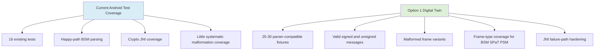
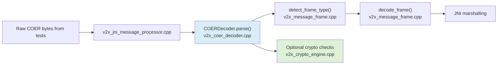
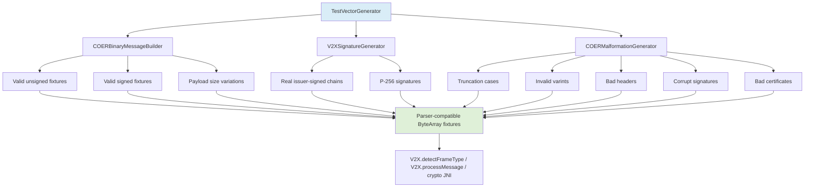

# Option 1 Plan: Digital Twin - Low-Level Design

**Branch:** `feature/option-1-digital-twin`
**Status:** Phase 1A, Phase 1B, Phase 1C, and the Phase 1D extension complete; ready for Phase 1E
**Scope:** Improve parser-frame and certificate-validation coverage using parser-compatible synthetic messages
**Gap Closure:** Parser framing and malformed-input coverage improved; certificate-chain and trust-anchor validation hardened through Android JNI tests; end-to-end negative signed-message integration coverage added
**Effort:** 1-2 weeks complete

**Implementation Handoff:** See [`docs/V2X-CRYPTO-CHAIN-HANDOFF.md`](./V2X-CRYPTO-CHAIN-HANDOFF.md) for the current implemented state, certificate-chain hardening work, trust-anchor flow, and latest passing test baseline.

---

## Executive Architecture

### Current State vs Option 1

### Objective

Build a Kotlin-side synthetic message generator and malformed-frame generator that produce binary COER messages matching the current native parser contract.

This option is intended to:
- improve parser robustness coverage for the format the app actually handles
- strengthen JNI test coverage using parser-compatible signed and unsigned fixtures
- avoid protocol drift into full ASN.1 / standards-faithful semantic payload generation

---

## Current Technical Baseline

### Parser Processing Pipeline

The active parser pipeline is:

`V2X.processMessage()`
-> `v2x_jni_message_processor.cpp`
-> `COERDecoder::parse()` in `native-engine/src/v2x_coer_decoder.cpp`
-> `detect_frame_type()` / `decode_frame()` in `native-engine/src/v2x_message_frame.cpp`

### Current Test Coverage State

Current Android instrumented baseline:
- `V2XJNITest.kt`
- `67` passing tests in the active `android-app` instrumentation suite
- valid BSM, SPaT, and PSM fixture generation coverage
- signed-message and certificate-chain JNI coverage with positive and negative cases
- completed malformation coverage for truncation, invalid varints, bad versions, unsupported frame types, length overclaims, signed-container corruption, and grouped malformed fixture catalogs
- completed end-to-end negative signed-message rejection coverage through `V2X.processMessage(...)`

Frame parsing gaps:
- header byte: basic version/path coverage exists, edge combinations are still limited
- varint length encoding: short-form is covered, long-form and malformed cases are limited
- payload extraction: valid payloads are covered, truncation and size-variation coverage are limited
- signature container: algorithm/signature/certificate parsing works, but variant depth and truncation coverage are limited

Crypto validation gaps:
- ECDSA verification: works with generated test fixtures through JNI
- certificate chain validation: explicit trust anchor and negative-path validation now work
- revocation checking: future PKI hardening work
- EKU/policy validation: future PKI hardening work

Semantic validation:
- BSM field ranges: out of scope here
- SPaT state validity: out of scope here
- PSM attributes: out of scope here

The current binary message contract is:
- `1 byte` header
- `varint` payload length
- `payload`
- if signed:
  - `1 byte` signature algorithm
  - `varint` signature length
  - `signature`
  - `varint` issuer certificate length
  - `issuer certificate`
  - optional `1 byte` chain depth
  - repeated `varint + cert bytes` for chain certificates

Important constraints:
- this is not a full standards-faithful IEEE 1609.2 / J2735 semantic encoder
- the generator must mirror the current native parser exactly
- JNI `processMessage()` currently has strongest end-to-end support for BSM
- SPaT and PSM are currently best validated through frame detection unless JNI marshalling is extended

---

## Option 1 Data Flow

### Test Vector Generation Pipeline

### File Structure

Implemented files:
- `android-app/src/androidTest/kotlin/com/sentinel/v2x/COERBinaryMessageBuilder.kt`
- `android-app/src/androidTest/kotlin/com/sentinel/v2x/V2XSignatureGenerator.kt`
- `android-app/src/androidTest/kotlin/com/sentinel/v2x/COERMalformationGenerator.kt`
- extended `android-app/src/androidTest/kotlin/com/sentinel/v2x/V2XJNITest.kt`
- `docs/OPTION-1-DIGITAL-TWIN-PLAN.md`
- `docs/TEST-VECTORS.md`

---

## Implementation Sequence

### Phase 1A: Binary Message Builder (Days 1-3)

Status: COMPLETE

Output:
- `COERBinaryMessageBuilder.kt` implemented
- parser-compatible unsigned and signed COER fixture assembly in place
- BSM, SPaT, and PSM builders verified through Android instrumentation coverage

### Phase 1B: Signature Generator (Days 4-6)

Status: COMPLETE with hardening beyond the original scope

Output:
- `V2XSignatureGenerator.kt` implemented
- real BouncyCastle-issued root/intermediate/leaf chains in test scope
- explicit trusted-root handling and Botan PKIX validation wired through JNI/Kotlin
- positive and negative certificate-chain coverage added

### Phase 1C: Malformation Generator (Days 7-9)

Status: COMPLETE

Output:
- `COERMalformationGenerator.kt` implemented
- malformed JNI rejection coverage for truncation, invalid varints, unsupported versions/frame types, signed-container corruption, length overclaims, chain depth/count mismatches, and truncated length-varint cases
- grouped malformed fixture catalogs for unsigned, signed, and combined parser rejection cases
- Phase 1C coverage verified in the Android instrumentation suite

### Phase 1D: JNI Integration (Days 10-11)

Status: COMPLETE with extension

Input:
- valid unsigned fixtures
- valid signed fixtures
- malformed fixtures
- existing certificate-chain negative cases

Build:
- orchestrate valid signed, valid unsigned, and malformed fixtures through grouped test execution in `V2XJNITest.kt`
- verify stable pass/fail behavior and zero crashes across repeated runs
- extend end-to-end negative signed-message tests through `V2X.processMessage()`
- make JNI `processMessage(...)` fail closed by enforcing the native verification pipeline before marshalling
- link `v2x_message_processor.cpp` and `v2x_payload_validator.cpp` into the Android JNI target
- fix signer public-key extraction and explicit DER ECDSA verification in native crypto
- allow parser-compatible signed payloads while keeping DER validation for DER-tagged payloads

Gate:
- BSM, SPaT, and PSM frame detection are all exercised
- JNI pass/fail behavior is stable across repeated runs
- valid signed BSM processes end to end with configured trust anchor
- invalid signed BSM fixtures fail end to end for wrong trust root, non-CA intermediate, expired leaf, not-yet-valid leaf, and leaf key-usage policy violations

Output:
- grouped valid unsigned fixture execution in `V2XJNITest.kt`
- grouped valid signed fixture execution in `V2XJNITest.kt`
- grouped malformed fixture rejection in `V2XJNITest.kt`
- repeated valid batch stability coverage in `V2XJNITest.kt`
- 5 end-to-end negative signed-message rejection tests in `V2XJNITest.kt`
- `67` passing Android instrumentation tests

### Phase 1E: Documentation (Day 12)

Status: NEXT

Planned output:
- final success-criteria table
- final gap analysis for future PKI hardening
- optional additional handoff polish if the branch is being prepared for review or merge

---

## Success Criteria Snapshot

Current verified criteria:
- `67` Android instrumentation tests pass
- valid unsigned BSM/SPaT/PSM fixtures detect correctly
- valid signed BSM processes end to end through `V2X.processMessage()`
- malformed COER fixtures fail gracefully
- certificate-chain trust, ordering, time-validity, and policy checks fail closed
- negative signed-message integration coverage fails closed through `V2X.processMessage()`

---

## Next Step

Proceed to Phase 1E documentation and final success-criteria wrap-up.