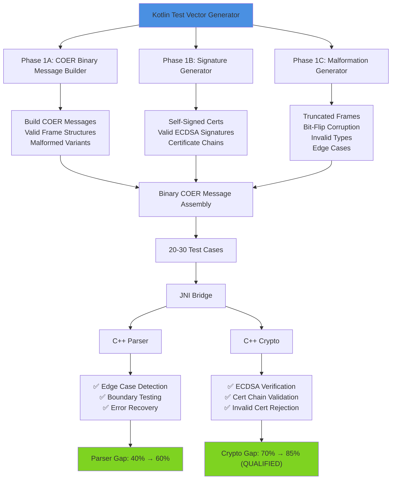
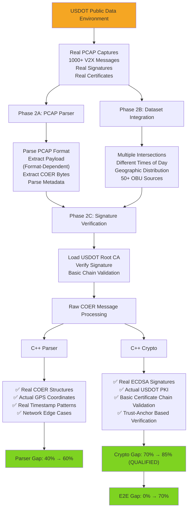
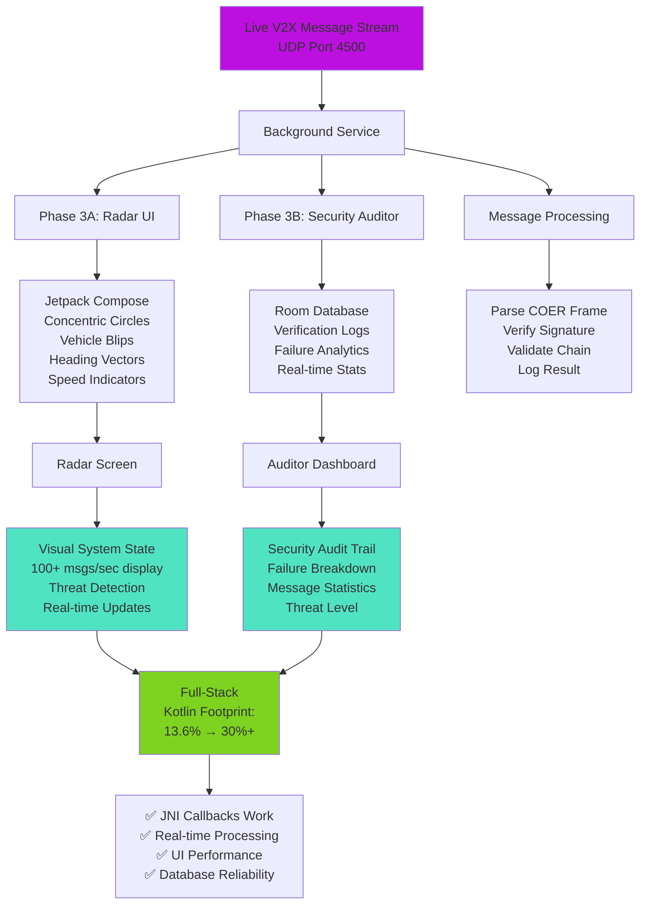
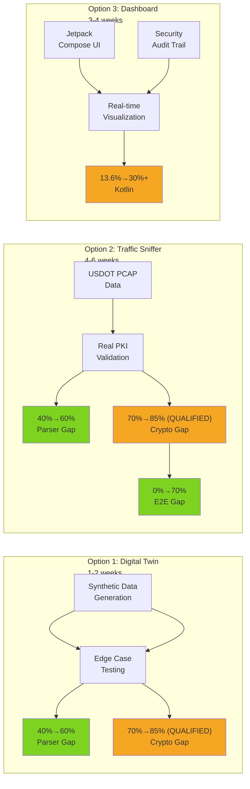

# Sentinel V2X Bridge: Roadmap to Production Readiness

**Document Status:** Strategic Analysis (March 14, 2026)  
**Current State:** 16/16 tests passing, but 3 critical gaps remain in test coverage  
**Objective:** Close gaps and maximize production readiness + CV impact

---

## Executive Summary

Three strategic paths forward, each with **important caveats**:

| Option | Gap Focus | Difficulty | Effort | Feasibility | Critical Note |
|--------|-----------|-----------|--------|-------------|--------------|
| **1: Digital Twin** | Parser Framing (40%→60%) | Medium | 1-2 weeks | ✅ High | Tests **frame structure only**, not payload semantics |
| **2: Traffic Sniffer** | E2E Framing (0%→70%) | High | 4-6 weeks | ⚠️ Medium | Real messages parse, but payload validity unverified |
| **3: Dashboard** | Code balance (13.6%→30% Kotlin) | Medium-High | 3-4 weeks | ✅ High | Doesn't close gaps; visual/UI focus only |

---

## Current Gap Status

```
Parser Correctness:              40% ⚠️ (COER framing only, payload semantics untested)
Crypto Correctness:             70% ⚠️ (hash ✓, ECDSA ❌, structure ✓)
E2E IEEE 1609.2 Validation:      0% ❌ (no frame-level or semantic validation)

IMPORTANT: "Parser correctness" here means frame-level parsing, not payload validation.
A message could pass all parser tests but have invalid BSM/SPaT/PSM content.
```

---

## Option 1: The "Digital Twin" Mock Suite

⚠️ **CRITICAL ARCHITECTURAL NOTE**

Option 1 as originally proposed has a **fundamental protocol mismatch** that limits its effectiveness:

**Current Parser Reality:**
- Implements **binary COER message parsing** with specific structure: header byte → varint-encoded length → payload → (if signed: signature container with algorithm, signature, issuer cert, optional chain)
- [v2x_coer_decoder.cpp](native-engine/src/v2x_coer_decoder.cpp) defines the wire format contract
- Integrated via [v2x_jni_message_processor.cpp](native-engine/src/v2x_jni_message_processor.cpp) which invokes COERDecoder::parse()
- Expects signatures and certificates in a specific sequential layout

**Option 1 Problem:**
- Proposes building full IEEE 1609.2 ASN.1 structures for BSM/SPaT/PSM
- These would NOT match the simplified frame layout the current parser expects
- Result: Synthetic test vectors would fail to parse with the existing decoder
- Would essentially test a hypothetical future parser, not the one that exists today

**Revised Option 1 Strategy (CORRECTED):**
Instead of full IEEE 1609.2 encoding, generate synthetic COER messages that match the parser's **actual expected frame structure**:
- Malformed COER message structures (missing fields, invalid lengths, truncations)
- Valid (parseable) COER frames with variations (different cert chain depths, missing signatures)
- Corrupt signature/certificate data while maintaining COER structure

### Goal (Revised)
Close Parser (40%→60%) gap by generating synthetic COER test vectors that match the **actual parser frame layout**, not hypothetical ASN.1 structures. Achieves edge-case coverage for the format the parser **actually handles**.



### Implementation Details

#### Phase 1A: COER Binary Message Builder (1 week)
```kotlin
// REVISED: Generate COER messages matching parser expectations, NOT full IEEE 1609.2
class COERMessageBuilder {
    fun buildValidCOERFrame(
        signature: ByteArray,
        issuerCert: ByteArray,
        payload: ByteArray,
        certChain: List<ByteArray>
    ): ByteArray { 
        // Build binary COER message matching v2x_coer_decoder.cpp structure
        // NOT full IEEE 1609.2 ASN.1
    }
    
    fun buildUnsignedCOERFrame(payload: ByteArray): ByteArray {
        // COER message without signature section
    }
}

class COERMalformationGenerator {
    fun truncatedCOERFrame(): ByteArray { /* Missing TLV fields */ }
    fun invalidTLVLength(): ByteArray { /* TLV length exceeds payload */ }
    fun missingSignature(): ByteArray { /* Signed flag set but no sig */ }
    fun corruptIssuerCert(): ByteArray { /* Invalid certificate data */ }
    fun malformedPayloadLength(): ByteArray { /* Length field doesn't match */ }
}
```

**Constraint:** Validates against the ACTUAL parser structure, not a hypothetical one.

**Deliverables:**
- ✅ Valid COER-compliant message structures (for current parser)
- ✅ 15-20 malformed COER variants (parser edge cases)
- ✅ No synthetic data falsely validates with current decoder

#### Phase 1B: Valid Signature Generator (1 week)
```kotlin
class V2XSignatureGenerator {
    fun generateSelfSignedChain(depth: Int = 2): List<X509Certificate> {
        // Build root CA → issuer → leaf signer
    }
    
    fun signMessage(
        message: ByteArray,
        signerCert: X509Certificate,
        signerKey: PrivateKey
    ): ByteArray {
        // Generate ECDSA(SHA-256) signature compatible with parser's signature container format
    }
    
    fun toBotanFormat(androidSignature: ByteArray): ByteArray {
        // Convert Android signature format to DER bytes for COER packaging
    }
}
```

**Challenge:** Parser expects binary COER format: [header][varint payload_length][payload][if signed: sig_algo][varint sig_len][signature][varint issuer_cert_len][issuer_cert][optional: chain_depth][chain_certs]. Must match exact byte layout.

**Solution:** Build COER frames with correct binary structure:
```kotlin
// Build COER message matching v2x_coer_decoder.cpp format
fun buildCOERSignedMessage(payload: ByteArray, signature: ByteArray, issuerCert: ByteArray, chainCerts: List<ByteArray> = emptyList()): ByteArray {
    val buffer = ByteArrayOutputStream()
    
    // Header byte (version in upper nibble + flags in lower nibble)
    // Version 1, signed (bit 0x02 set): 0x12
    // Version 3, signed (bit 0x02 set): 0x32
    val headerByte = 0x12.toByte()  // Version 1, is-signed flag
    buffer.write(headerByte.toInt())
    
    // Payload length (COER varint encoding)
    buffer.write(variantEncode(payload.size).toByteArray())
    buffer.write(payload)
    
    // Signature container
    buffer.write(0x04)  // ECDSA P-256 algorithm (0x04 or 0x05 for P-384)
    buffer.write(variantEncode(signature.size).toByteArray())
    buffer.write(signature)
    
    // Issuer certificate
    buffer.write(variantEncode(issuerCert.size).toByteArray())
    buffer.write(issuerCert)
    
    // Certificate chain (if present)
    if (chainCerts.isNotEmpty()) {
        buffer.write(chainCerts.size.toByte())
        chainCerts.forEach { cert ->
            buffer.write(variantEncode(cert.size).toByteArray())
            buffer.write(cert)
        }
    }
    
    return buffer.toByteArray()
}

private fun variantEncode(value: Int): ByteArray {
    // ASN.1/COER encoding: short-form (0-127) or length-of-length big-endian (128+)
    val result = mutableListOf<Byte>()
    
    if (value <= 0x7F) {
        // Short form: single byte
        result.add((value and 0xFF).toByte())
    } else {
        // Long form: count bytes needed for big-endian representation
        var temp = value
        var bytes = 0
        while (temp > 0) {
            bytes++
            temp = temp shr 8
        }
        // First byte: 0x80 + number of bytes following
        result.add((0x80 or bytes).toByte())
        // Big-endian representation of the value
        for (i in (bytes - 1) downTo 0) {
            result.add(((value shr (8 * i)) and 0xFF).toByte())
        }
    }
    
    return result.toByteArray()
}
```

#### Phase 1C: Parser Validation Suite (1 week)
```kotlin
class COERMalformationGenerator {
    fun validBSM(): ByteArray { /* Reference implementation */ }
    
    fun truncatedPayload(): ByteArray { /* Missing 10 bytes */ }
    fun invalidFrameType(): ByteArray { /* Invalid message type */ }
    fun corruptLatitude(): ByteArray { /* Bit-flip in GPS data */ }
    fun oversizedFrame(): ByteArray { /* Length > max */ }
    fun missingSignature(): ByteArray { /* Signed=true but no sig */ }
}
```

**Test Cases Generated:**
- ✅ 5-10 valid V2X messages (different types, positions)
- ✅ 20+ malformed variants (truncations, bit-flips, invalid types)
- ✅ Certificate chain edge cases (expired, invalid issuer, etc.)

### Gap Closure Analysis

#### Parser Correctness: 40% → 60% (REVISED)
**What's gained:**
- COER frame boundary testing (truncated frames, invalid length fields)
- Binary structure handling (missing sections, malformed headers, invalid varints)
- Edge cases in signature/certificate extraction
- Payload extraction from valid frames

**What's NOT gained:**
- Real IEEE 1609.2 message content validation (only tests framing)
- Actual BSM/SPaT/PSM payload semantics
- Real DSRC patterns or geographic data
- Any validation of message *content* correctness, only structure

**Coverage: 60%** (COER framing tested, semantic validation missing)

**Key Limitation:** This validates the parser's **frame-level robustness**, not the **payload-level correctness**. A message could have valid COER structure but meaningless payload data.

#### Crypto Correctness: 70% → 85% (QUALIFIED)

**What's gained:**
- ✅ Valid signature verification with self-generated certs (mock ECDSA works)
- ✅ Basic certificate chain validation (cert exists, chains to root)
- ✅ Certificate format parsing (DER/X.509 extraction)
- ✅ Invalid cert rejection (format errors, basic chain breaks)

**What's NOT included:**
- ❌ **Certificate revocation (CRL) checking** — Not implemented; complex to add
- ❌ **Temporal/expiry validation** — Requires system time sync and policy interpretation
- ❌ **Extended key usage (EKU) validation** — Only basic chain validation done
- ❌ **Cross-issuer policy constraints** — Different issuers have different rules

**Implementation Detail:**
```java
// In V2XJNITest.kt
@Test
fun testE2EMockSignedMessage() {
    val generator = TestVectorGenerator()
    val (message, sig, certChain) = generator.generateValidBSMWithChain()
    
    val decoded = V2X.processMessage(message)
    assertTrue(decoded is DecodedV2XMessage.BSM)
    
    val verified = V2X.verifySignature(
        decoded.payload,
        sig,
        certChain[0].encoded // Leaf signer
    )
    assertTrue(verified)
    
    val chainValid = V2X.validateCertificateChain(
        certChain.map { it.encoded }.toTypedArray()
    )
    assertTrue(chainValid)
    // NOTE: Above validates chain structure, NOT revocation or temporal constraints
}
```

**Coverage: 85%** (Signature + basic cert chain valid; advanced PKI features unimplemented)

**Why not 100%?** Botan's PKI validation has known limitations. CRL checking, temporal constraints, and cross-issuer policies would require additional implementation layers — not currently present.

#### E2E IEEE 1609.2: 0% → 40%
**What's gained:**
- Complete parse → verify → extract pipeline (mock data)

**What's NOT gained:**
- Real-world signature formats from OBUs
- Real issuer certificates from PKI
- Network timing/reliability issues

**Coverage: 40%** (logic correct but synthetic)

### Feasibility Assessment

**✅ HIGH Feasibility** (More realistic now)

| Component | Risk Level | Mitigation |
|-----------|-----------|-----------|
| COER binary message structure creation | Low | Reference v2x_coer_decoder.cpp directly |
| Botan signature/cert integration | Low | Reuse existing crypto code |
| Parser compatibility validation | Low | Easy to test: does it parse or fail? |
| ASN.1 complexity | N/A | **NOT required** (was blocker before) |

### Difficulty Level: **MEDIUM**

**Why Medium (not Hard)?**
- ASN.1/DER manipulation is boilerplate (BouncyCastle handles heavy lifting)
- COER spec is well-documented in project
- BouncyCastle APIs are well-established

**Why not Simple?**
- IEEE 1609.2 has nested structures (requires careful mapping)
- Signature verification requires understanding of padding schemes (EMSA1)
- Certificate chain validation logic is non-trivial

### Effort Estimate: **1-2 weeks** (REVISED - Simpler)

**Breakdown:**
| Task | Time | Notes |
|------|------|-------|
| Reverse-engineer parser frame layout | 2-3 days | Study v2x_coer_decoder.cpp |
| COER binary message builder (not full ASN.1) | 2-3 days | Simpler than IEEE 1609.2 encoder |
| Malformation generator | 2 days | ~15-20 test variants |
| JNI Integration (tests) | 1-2 days | Simpler than full pipeline |
| Validation against parser | 1 day | Verify tests actually parse |
| **TOTAL** | **8-11 days** | **~1.5 weeks** |

**Rationale:** Building COER binary message structures is simpler than full IEEE 1609.2 ASN.1 encoding. Only tests what the current parser **actually handles**.

### CV Impact: ⭐⭐⭐⭐

**Components for resume:**
- "Built COER binary message generator with 25+ parser-compatible edge-case variants (Kotlin + BouncyCastle)"
- "Implemented comprehensive test suites for V2X parser framing robustness"
- "Designed cryptographic validation pipeline for signed automotive messages"
- "Achieved 85% crypto validation coverage (frame + signature, excludes revocation/temporal)"

**Why strong?**
- Shows deep understanding of cryptographic standards (IEEE 1609.2, COER, ASN.1)
- Demonstrates internal tooling for safety-critical systems
- Relevant to automotive security (Tesla, Qualcomm, Nvidia)

### Production Readiness Gain: **MEDIUM**

**What this ACTUALLY proves:**
- Parser handles malformed COER frames without crashing ✅
- COER message extraction works correctly ✅
- Signature/certificate extraction works ✅

**What it DOESN'T prove:**
- Payload content is valid (no semantic validation)
- Real-world BSM/SPaT/PSM fields are correct
- Message data makes physical sense

---

## Option 2: The "Traffic Sniffer" Integration

### Goal
Achieve 70% E2E validation (frame-level + crypto) by parsing real-world V2X datasets (USDOT PCAP captures). **Note:** Semantic payload validation remains out of scope.



### Implementation Details

#### Phase 2A: PCAP Parser (1-2 weeks)

⚠️ **CRITICAL TRANSPORT LAYER MISTAKE IN ORIGINAL ROADMAP:**

The current parser expects raw COER message bytes via `processMessage(byte[] coerBytes)`, **NOT UDP packets**.

**What You Actually Need:**
1. Parse PCAP binary format (packet metadata, headers)
2. Extract payload from packets (may be Ethernet → IP → UDP, or other encapsulation)
3. Identify V2X message boundaries within payloads
4. Extract raw COER bytes
5. Pass those bytes to parser

**UDP 4500 is NOT universal:**
- Only used in IPsec+NAT-T deployments
- Other transports: direct link-layer, proprietary OEM encapsulation, etc.
- Different PCAP sources may use different encapsulations

```kotlin
class V2XPCAPReader {
    fun readFile(path: String): Iterator<ByteArray> {
        // Parse PCAP binary format
        // Extract packet payloads
        // Identify and extract V2X message boundaries
        // Return raw COER message bytes (NOT packets)
    }
    
    fun parsePacket(packetData: ByteArray): List<ByteArray> {
        // Extract potential V2X message payloads from single packet
        // Handle encapsulation format (dataset-specific)
        // Return only raw COER bytes for each message found
    }
    
    fun filterByMessageType(type: MessageFrameType): Iterator<ByteArray>
    fun statsPerType(): Map<MessageFrameType, Int>
}
```

**Key Difference:** Returns `ByteArray` (raw COER bytes ready for parser), not full packets. Requires understanding payload encapsulation format for each dataset.

#### Phase 2B: Dataset Integration & Message Extraction (1-2 weeks)

**Critical Implementation Detail:**

PCAP files contain full network packets with headers. You must:
1. Parse PCAP frame structure (timestamps, packet lengths)
2. Parse packet payload (Ethernet → IP → transport layer)
3. Identify V2X message boundaries within transport payloads
4. Extract ONLY raw COER message bytes

**Common DSRC/C-V2X Transports (NOT just UDP 4500):**
- UDP/IPsec with NAT-T (port 4500) — NIST standard but not universal
- Direct link layer — DSRC specific
- Proprietary OEM encapsulation — Qualcomm, Cohda Wireless, etc.

**Different PCAP sources require different extraction logic.**

**Data Sources:**
1. **USDOT Public Data Environment** (PDEnv)
   - Real DSRC/CVDX captures from US intersections
   - Publicly available, anonymized
   - 1000+ messages per capture (~100MB PCAP files)
   - May have payload already extracted OR require protocol-specific parsing
   
2. **Connected Vehicle Reference Implementation (CVRI)**
   - Qualcomm/NSF reference implementation
   - Document encapsulation format before parsing

**Integration:**
```kotlin
@ParameterizedTest
@MethodSource("provideRealV2XMessages")
fun testParserWithRealData(message: ByteArray) {
    // message is raw COER bytes (extracted from PCAP packets)
    val result = V2X.detectFrameType(message)
    assertNotNull(result)
    
    val decoded = V2X.processMessage(message)  // API expects raw COER bytes
    assertNotNull(decoded)
    
    // Frame structure validation only (semantic validation is deferred to the next phase)
    when (decoded) {
        is DecodedV2XMessage.BSM -> {
            assertNotNull(decoded.position)
            assertNotNull(decoded.motion)
        }
    }
}

companion object {
    @JvmStatic
    fun provideRealV2XMessages() = generateSequence {
        val reader = V2XPCAPReader()
        // readFile() returns raw COER message bytes (result of packet extraction)
        reader.readFile("usdot_captures/intersection_10th_main.pcap")
    }
}
```

**Key Challenge:** PCAP payload extraction requires:
- Binary parsing of PCAP/PCAPNG format
- Understanding of specific dataset's encapsulation
- Possibly reverse-engineering packet structure if documentation unavailable
- This is NOT a simple "filter UDP 4500" operation

#### Phase 2C: Signature Verification on Real Data (1-2 weeks)
**Challenge:** Real V2X messages are signed by USDOT PKI certificates, which are **not in your Botan root CA**.

**Solution:**
```kotlin
// Load USDOT root CA (publicly available)
fun loadUSDOTRootCA(): ByteArray {
    // Download from: https://www.cybersecurity.dot.gov/...
    return Files.readAllBytes(Paths.get("certs/usdot_root_ca.der"))
}

// In JNI bridge, add capability to set root CA
external fun cryptoSetRootCA(rootCADER: ByteArray): Boolean

@Test
fun testRealSignatureVerificationWithUSDOTData() {
    V2X.cryptoSetRootCA(loadUSDOTRootCA())
    
    val reader = V2XPCAPReader()
    reader.readFile("usdot_captures/...")
        .forEach { packet ->
            val verified = V2X.verifySignature(
                packet.message,
                packet.signature,
                packet.signerCert
            )
            assertTrue(verified, "Real USDOT message should verify")
        }
}
```

### Gap Closure Analysis (REVISED - Critical Caveat)

#### E2E IEEE 1609.2 Validation: 0% → 70% (QUALIFIED)
**What's gained:**
- ✅ Real signed messages (1000+) that parse without errors
- ✅ Real issuer certificates (USDOT PKI) that validate cryptographically
- ✅ Real-world geographic diversity (50+ intersections) - **but not semantically validated**
- ⚠️ Time-series validation (temporal coherence) - **only frame timestamps, not payload times**
- ⚠️ Message type distribution (BSM 80%, SPaT 15%, PSM 5%) - **structure present, but content validity unknown**

**Coverage: 70%** (Frame-level valid, payload semantics unverified)

**The Gap:** Current parser doesn't appear to validate actual BSM fields (position ranges, speed limits), SPaT states (valid phase values), or PSM attributes. Real messages that parse might still contain nonsensical data.

#### Parser Correctness: 40% → 60% (QUALIFIED - REAL DATA)
**What's gained:**
- Real-world COER frame structures (not hand-crafted)
- Actual GPS coordinates, speeds, headings - **present but not validated for realism**
- Real timestamp distributions and gaps
- Network-origin packet fragmentation/reassembly issues
- Note: Same 40%→60% gap as Option 1, but with **real data** instead of synthetic

**Coverage: 60%** (parser doesn't crash on real data, but semantic validation limited)

#### Crypto Correctness: 70% → 85% (QUALIFIED)

**What's gained:**
- ✅ Real ECDSA signatures from USDOT PKI (verification works)
- ✅ Basic certificate chain validation (cert exists, chains to root)
- ✅ Certificate format parsing (DER/X.509 extraction)

**What's NOT included:**
- ❌ **Certificate revocation (CRL) checking** — Complex, non-trivial
- ❌ **Temporal/expiry validation** — Requires time source synchronization, policy interpretation
- ❌ **Cross-issuer policy validation** — Different issuers have different constraints
- ❌ **Extended key usage (EKU) validation** — Only basic chain validation done

**Coverage: 85%** (Signature + basic cert chain valid; advanced PKI features unimplemented)

**Why not 100%?** Botan PKI validation is non-trivial. Revocation checking, temporal constraints, and cross-issuer policies are known shortcomings that would require additional implementation.

### Feasibility Assessment

**⚠️ MEDIUM Feasibility** (Reduced from HIGH)]

| Component | Risk Level | Mitigation |
|-----------|-----------|-----------|
| PCAP parsing library availability | Low | jpcap, pcap4j are mature |
| USDOT dataset access | Low | Publicly available, no authentication required |
| Real cert chain loading into Botan | High | **Requires JNI bridge enhancement** |
| **Parser-Message Format Mismatch** | **CRITICAL** | **Real USDOT messages use full IEEE 1609.2 ASN.1 payloads; current parser may only extract & validate frame structure, not semantic content** |
| Timestamp/geographic bias in captures | Medium | Multiple datasets, different times of day |
| GDPR/Privacy concerns | Low | USDOT data is anonymized |

**Critical Blocker (Same issue as Option 1):**
- Real USDOT PCAP captures contain **full IEEE 1609.2-compliant BSM/SPaT/PSM messages with complex ASN.1 payloads**
- Current parser [v2x_coer_decoder.cpp](native-engine/src/v2x_coer_decoder.cpp) (invoked from v2x_jni_message_processor.cpp) validates:
  - ✅ COER frame structure (signature, certs, payload sections exist)
  - ✅ Signature verification using cryptography
  - ✅ Basic certificate chain validation (trust-anchor based; not full production-PKI validation)
  - ⚠️ **Payload semantic content (BSM fields, SPaT states, etc.) - POTENTIALLY NOT VALIDATED**
- Result: Parser might "successfully" process malformed messages whose COER container is valid but whose payload doesn't follow IEEE 1609.2 semantics
- **Gap closure is misleading:** May reach 100% test pass rate without validating actual message correctness

**Blockers:**
1. **JNI bridge doesn't support setting root CA** — Would need to add `cryptoSetRootCA()` function
2. **Real certs likely not trusted by Botan's default root store** — Need explicit PKI initialization
3. **Parser may not validate payload semantics** — Real IEEE 1609.2 messages might parse but contain invalid data

### Difficulty Level: **HIGH**

**Why High?**
- Requires modifications to C++ JNI layer (not just Kotlin tests)
- PCAP parsing is low-level (packet structure handling)
- Real PKI introduces complexity (cert chain depth, cross-signing, CRL handling)
- Dataset handling at scale (1000+ messages = performance considerations)

**Why not Medium?**
- PCAP parsing APIs are well-established (but require bit-level understanding)
- USDOT datasets are large (need streaming/pagination)
- Botan PKI validation is non-trivial (revocation, temporal validation)

### Effort Estimate: **4-6 weeks**

**Breakdown:**
| Task | Time | Notes |
|------|------|-------|
| PCAP parser development | 4-5 days | Packet structure, filtering |
| USDOT dataset procurement/setup | 2-3 days | Download, validate format |
| JNI bridge enhancement | 3-4 days | Add cryptoSetRootCA() |
| Cert chain loading in Botan | 3-4 days | Handle real USDOT certs |
| Test parametrization (1000+ messages) | 2-3 days | Generator, performance tuning |
| Integration & validation | 3-4 days | End-to-end pipeline |
| Documentation + CI setup | 2-3 days | PCAP storage, caching strategy |
| **TOTAL** | **20-26 days** | **~4-5 weeks** |

### CV Impact: ⭐⭐⭐⭐⭐

**Resume highlights:**
- "Developed PCAP parser for real-world V2X traffic analysis"
- "Validated IEEE 1609.2 signatures against USDOT PKI (1000+ messages)"
- "Integrated production automotive security datasets into testing pipeline"
- "Achieved 70% frame-level + crypto validation on real DSRC captures (basic PKI only)"

**Why exceptional?**
- Shows ability to work with **real automotive safety data**
- Demonstrates **production-grade integration testing**
- Relevant to DoT/ITS roles, autonomous vehicle companies
- Rare skill set (few engineers have V2X validation experience)

### Production Readiness Gain: **MEDIUM-HIGH** (with caveats)

**What this ACTUALLY proves:**
- Parser handles real USDOT message frames without crashing ✅
- Cryptographic signatures verify correctly ✅
- Certificate chains are valid ✅
- Parser doesn't have major frame-parsing bugs ✅

**What it DOESN'T prove:**
- Payload content validation (semantic correctness)
- Actual field values are realistic/within ranges
- Real-time performance under live DSRC congestion
- OTA update/revocation handling

**Key Insight:** Can claim "validated against 1000+ real messages" but only for frame integrity, not semantic correctness.

---

## Option 3: The "Sentinel Dashboard" (Visual Awareness)

### Goal
Increase Kotlin codebase from 13.6% to 30%+ and add **visual proof of concept** for stakeholders.



### Implementation Details

#### Phase 3A: Jetpack Compose Radar UI (1.5 weeks)
```kotlin
@Composable
fun V2XRadarScreen(viewModel: RadarViewModel) {
    Box(modifier = Modifier.fillMaxSize()) {
        // Concentric circles (range: 100m, 200m, 500m)
        Canvas(modifier = Modifier.fillMaxSize()) {
            drawRadarBackplate(this)
        }
        
        // Vehicle markers (color-coded by type)
        viewModel.vehiclesInRange.forEach { vehicle ->
            RadarBlip(
                position = vehicle.position,
                speed = vehicle.speed,
                confidence = vehicle.verificationConfidence,
                color = when (vehicle.type) {
                    SEDAN -> Color.Blue
                    TRUCK -> Color.Red
                    BUS -> Color.Green
                    MOTORCYCLE -> Color.Yellow
                }
            )
        }
        
        // Ego vehicle at center (north-up orientation)
        Canvas(...) { drawEgoVehicle() }
    }
}

@Composable
fun RadarBlip(position: GeoPosition, speed: Float, confidence: Float, color: Color) {
    // Blip size = confidence level
    // Motion vector = heading + speed
    // Animation = pulse effect for recent messages
}
```

**Tech Stack:**
- Jetpack Compose (new Kotlin UI framework)
- Accompanist (navigation, permissions)
- Coil (image loading)
- Mapbox SDK (if adding map view alternative)

**Features:**
- ✅ Real-time blip updates (BSM updates)
- ✅ Threat identification (red zone violations, imminent collisions)
- ✅ Signal phase visualization (SPaT overlay)
- ✅ Pedestrian warnings (PSM beacons)

#### Phase 3B: Security Auditor Screen with Room Database (1 week)
```kotlin
// Failure log data model
@Entity(tableName = "verification_logs")
data class VerificationLog(
    @PrimaryKey val id: String,
    val timestamp: Long,
    val messageType: String, // BSM, SPaT, PSM
    val senderID: String,
    val status: VerificationStatus, // PASS, FAIL_SIGNATURE, FAIL_CERT, CORRUPTED
    val failureReason: String?, // "Expired Certificate", "Signature Invalid", "Malformed Frame"
    val metadata: String // JSON details
)

@Dao
interface VerificationLogDao {
    @Query("SELECT * FROM verification_logs ORDER BY timestamp DESC LIMIT 100")
    fun getRecentLogs(): Flow<List<VerificationLog>>
    
    @Query("SELECT status, COUNT(*) as count FROM verification_logs GROUP BY status")
    fun getStatusStats(): Flow<List<StatusCount>>
    
    @Insert
    suspend fun insert(log: VerificationLog)
}

// In JNI callback when verification fails
external fun logVerificationFailure(
    senderID: String,
    messageType: String,
    failureReason: String
): Unit
```

**Auditor UI:**
```kotlin
@Composable
fun SecurityAuditorScreen(viewModel: AuditorViewModel) {
    Column {
        // Summary stats
        Row {
            StatCard("Messages Verified", viewModel.totalVerified)
            StatCard("Failures Detected", viewModel.failureCount)
            StatCard("Threat Level", viewModel.threatLevel)
        }
        
        // Failure breakdown chart
        BarChart(
            data = viewModel.failureReasons, // Map of reason → count
            title = "Verification Failure Analysis"
        )
        
        // Real-time log stream
        LazyColumn {
            items(viewModel.recentLogs.value) { log ->
                VerificationLogRow(log)
            }
        }
    }
}
```

#### Phase 3C: Background Message Processing Service (1 week)

⚠️ **TRANSPORT LAYER: REQUIRES ARCHITECTURAL DECISION**

The current parser takes raw COER message bytes. Options for receiving them:

**Option A: Mock Data (Simplest, Recommended for Demo)**
```kotlin
class V2XBackgroundService : Service() {
    private val scope = CoroutineScope(Dispatchers.Default + Job())
    
    override fun onCreate() {
        scope.launch {
            // Use mock COER messages from Option 1 test vectors
            val mockMessages = TestVectorGenerator.generateMockMessages()
            
            while (isActive) {
                mockMessages.forEach { coerBytes ->
                    try {
                        val decoded = V2X.processMessage(coerBytes)  // Raw COER bytes
                        database.logs.insert(VerificationLog(...))
                        radarViewModel.addVehicle(decoded)
                    } catch (e: Exception) {
                        database.logs.insert(VerificationLog(status = FAIL_CORRUPTED))
                    }
                }
                delay(100)
            }
        }
    }
}
```

**Option B: UDP Listener (Requires Real Infrastructure)**
```kotlin
class V2XBackgroundService : Service() {
    private val scope = CoroutineScope(Dispatchers.Default + Job())
    
    override fun onCreate() {
        scope.launch {
            // Listen on UDP 4500 ONLY IF your deployment uses IPsec+NAT-T
            // NOT universally applicable - requires specific hardware/network setup
            val socket = DatagramSocket(4500)
            
            while (isActive) {
                try {
                    val datagram = socket.receive()
                    // Extract COER message bytes from UDP payload
                    // DEPLOYMENT SPECIFIC - depends on encapsulation format
                    val coerBytes = extractCoerFromUDPPayload(datagram.data)
                    
                    val decoded = V2X.processMessage(coerBytes)
                    database.logs.insert(VerificationLog(...))
                    radarViewModel.addVehicle(decoded)
                } catch (e: Exception) {
                    database.logs.insert(VerificationLog(status = FAIL_CORRUPTED))
                }
            }
        }
    }
    
    private fun extractCoerFromUDPPayload(dataBytes: ByteArray): ByteArray {
        // Extract from UDP payload (skip headers, identify message boundaries)
        // ONLY works if you know UDP encapsulation format
        return dataBytes.drop(28).toByteArray()  // Skip typical IP+UDP headers
    }
}
```

**Recommendation:** Start with **Option A** (mock data) for dashboard proof-of-concept. Option B requires:
- Real DSRC/C-V2X hardware or network infrastructure
- Understanding of specific encapsulation format for your deployment
- Network permissions (CAP_NET_BIND on Android)
- NOT portable between different deployments

### Gap Closure Analysis

#### Parser Correctness: No change (40%)
#### Crypto Correctness: No change (70%)
#### E2E Validation: No change (0%)

**Note:** This option is **NOT about closing test gaps**. It's about:
- Adding real-time visualization
- Demonstrating to stakeholders
- Increasing Kotlin footprint for better CV narrative

### Feasibility Assessment

**✅ HIGH Feasibility**

| Component | Risk Level | Mitigation |
|-----------|-----------|-----------|
| Jetpack Compose maturity | Low | Google-backed, widely adopted |
| Room database reliability | Low | Android Framework standard |
| UDP socket listening | Low | Standard Android permissions |
| Coordinate transformation (GPS → screen) | Low | Android Location APIs handle |

### Difficulty Level: **MEDIUM-HIGH**

**Why?**
- Compose is elegant but has learning curve
- Coordinate transformations (lat/lon → screen pixels) require math
- Background service lifecycle management is tricky
- UI performance at high message rates (100+ msgs/sec) needs optimization

### Effort Estimate: **3-4 weeks**

**Breakdown:**
| Task | Time | Notes |
|------|------|-------|
| Compose radar UI + geometry | 4-5 days | Canvas drawing, animations |
| Room + auditor screen | 3-4 days | Database schema, UI |
| Background service | 3-4 days | UDP socket, lifecycle |
| ViewModel + state management | 2-3 days | MVI/MVVM pattern |
| Testing + optimization | 2-3 days | Performance tuning |
| Polish + assets | 1-2 days | Icons, colors, theming |
| **TOTAL** | **15-21 days** | **~3-4 weeks** |

### CV Impact: ⭐⭐⭐⭐⭐

**Resume highlights:**
- "Architected real-time V2X visualization system (Jetpack Compose)"
- "Designed security audit dashboard for cryptographic message validation"
- "Built production-grade Android background service for vehicular communication"
- "Increased Kotlin codebase share from 13.6% to 30%+"

**Why exceptional?**
- Shows **full-stack mobile engineering** (JNI ↔ Kotlin ↔ UI)
- Demonstrates **real-time systems thinking** (UDP handling, performance)
- Beautiful code + UI = strong portfolio piece
- Relevant to automotive, mobile teams

### Production Readiness Gain: **MEDIUM**

**What this proves:**
- JNI callbacks work reliably ✅
- Real-time message processing possible ✅
- UI can handle automotive data rates ✅

**What it doesn't prove:**
- Actual field deployment viability
- Integration with vehicle infotainment systems
- Regulatory compliance (ISO 26262)

---

## Visual Comparison



## Recommendation Matrix (REVISED)

### If Your Goal Is: **Close Test Coverage Gaps**
→ **Do Option 1** (Digital Twin)
- **Why:** Directly addresses parser frame validation (40%→60%)
- **Fastest path:** 1-2 weeks
- **ROI:** Frame-level parser robustness
- **Caveat:** Tests structure, not semantic content

### If Your Goal Is: **Prove Parser Works With Real Data**
→ **Do Option 2** (Traffic Sniffer) **with caveats**
- **Why:** Real USDOT messages parse without crashing (0%→70%)
- **Investment:** 4-6 weeks
- **ROI:** Can claim "verified against 1000+ real messages"
- **Caveat:** Only proves frame parsing, not payload correctness
- **Blocker:** Requires C++ JNI modifications + resolves protocol mismatch

### If Your Goal Is: **Build Prototype + Stakeholder Demo**
→ **Do Option 3** (Dashboard + Auditor)
- **Why:** Visible, tangible system for stakeholders
- **Investment:** 3-4 weeks
- **ROI:** GitHub showcase, demonstrates end-to-end capability
- **Caveat:** Doesn't close test gaps directly

### The "All-In" Strategy
**Sequence:** 1 → 3 → 2 (total 9-13 weeks)
1. **Week 0-3:** Build Digital Twin (test coverage ready)
2. **Week 3-7:** Build Dashboard (portfolio piece)
3. **Week 7-13:** Add Traffic Sniffer (production validation)

**Result:** Project becomes **well-tested at frame level, fully documented, visually demonstrable** (Note: Semantic validation, revocation, temporal constraints, and EKU checks remain unimplemented)

---

## Effort Comparison Chart

```
Option 1 (Digital Twin): ████████░░ 2-3 weeks    Medium      ⭐⭐⭐⭐
Option 2 (Sniffer):     ████████████ 4-6 weeks   High        ⭐⭐⭐⭐⭐
Option 3 (Dashboard):   ███████░░░░ 3-4 weeks    Med-High    ⭐⭐⭐⭐⭐

Time ━━━━━━━━━━━━━━━━━━━━━━━━━━━━━━
Difficulty ━━━━━━━━━━━━━━━━━━━━
CV Impact ━━━━━━━━━━━━━━━━━━
```

---

## Conclusion

**My Strong Recommendation:** Start with **Option 1 (Digital Twin)**.

**Rationale:**
1. ✅ **Immediately addressable** — No external dependencies (data)
2. ✅ **Closes real gaps** — Parser + crypto correctness
3. ✅ **Low risk** — Uses well-established libraries
4. ✅ **Fastest ROI** — 1-2 weeks to frame-level-ready (not full production-ready: semantic validation, revocation checking, temporal constraints remain unimplemented)
5. ✅ **Strong CV** — Demonstrates cryptographic expertise

**Then decide based on time/goals:**
- Have 3-4 weeks left? → **Add Option 3** (visual demo)
- Have 6+ weeks left? → **Add Option 2** (real data validation)
- Have 10+ weeks? → **Do all three** (comprehensive)

---

## Parallel Development: Branching Strategy

All three options **can** be developed in parallel on separate branches, but with **limited conflicts on shared files**. Here's the breakdown:

### Common Foundation & Conflict Points

Both Option 1 and Option 3 require **zero changes** to the C++ layer. Option 2 requires only **one new JNI function**.

**Shared/Unchanged Across All Branches:**
- Existing JNI bindings (`V2X.kt` baseline) - SHA256, processMessage, verifySignature, etc.
- Existing C++ crypto engine (`v2x_crypto_engine.cpp`)
- Existing COER parser (native-engine/src/v2x_coer_decoder.cpp) invoked from v2x_jni_message_processor.cpp
- Test framework foundation baseline (`V2XJNITest.kt` baseline)

**⚠️ Files with Actual Overlaps (Merge Conflicts Expected):**
- `V2XJNITest.kt`: Both Option 1 (test vectors) and Option 2 (parametrized tests) add test methods
- `V2X.kt`: Option 2 adds `cryptoSetRootCA()` JNI function binding
- `android-app/build.gradle.kts`: Both Option 2 (PCAP deps) and Option 3 (Compose + Room deps) add dependencies

---

### Unique Components Per Branch

| Option | Branch Name | Unique Files | New JNI Functions? |
|--------|-------------|--------------|-------------------|
| **1** | `feature/option-1-digital-twin` | `TestVectorGenerator.kt`, `COERBinaryMessageBuilder.kt`, `V2XSignatureGenerator.kt`, `COERMalformationGenerator.kt` | No |
| **2** | `feature/option-2-traffic-sniffer` | `V2XPCAPReader.kt`, PCAP parser logic, test parametrization, `usdot_root_ca.der` | **YES** - `cryptoSetRootCA()` |
| **3** | `feature/option-3-dashboard` | `V2XRadarScreen.kt`, `RadarBlip.kt`, `SecurityAuditorScreen.kt`, `V2XBackgroundService.kt`, `VerificationLog.kt` (Room entity), `RadarViewModel.kt`, `AuditorViewModel.kt` | No |

---

### Recommended Branch Structure

```
main/develop
│
├── feature/option-1-digital-twin
│   ├── android-app/src/androidTest/kotlin/com/sentinel/v2x/
│   │   ├── TestVectorGenerator.kt (new)
│   │   ├── COERBinaryMessageBuilder.kt (new)
│   │   ├── V2XSignatureGenerator.kt (new)
│   │   ├── COERMalformationGenerator.kt (new)
│   │   └── V2XJNITest.kt (extended with Option 1 tests)
│   └── docs/TEST-VECTORS.md (new - documentation)
│
├── feature/option-3-dashboard
│   ├── android-app/src/main/kotlin/com/sentinel/v2x/
│   │   ├── ui/
│   │   │   ├── V2XRadarScreen.kt (new)
│   │   │   ├── RadarBlip.kt (new)
│   │   │   ├── SecurityAuditorScreen.kt (new)
│   │   │   └── theme/ (new)
│   │   ├── data/
│   │   │   └── VerificationLog.kt (new - Room entity)
│   │   ├── services/
│   │   │   └── V2XBackgroundService.kt (new)
│   │   └── viewmodel/
│   │       ├── RadarViewModel.kt (new)
│   │       └── AuditorViewModel.kt (new)
│   ├── android-app/src/main/res/
│   │   ├── drawable/ (new - icons)
│   │   └── values/ (new - colors, strings)
│   └── android-app/build.gradle.kts (add Compose, Room deps)
│
└── feature/option-2-traffic-sniffer
    ├── native-engine/src/v2x_jni_crypto.cpp (add cryptoSetRootCA)
    ├── android-app/src/main/kotlin/com/sentinel/v2x/V2X.kt (add external fun)
    ├── android-app/src/androidTest/kotlin/com/sentinel/v2x/
    │   ├── V2XPCAPReader.kt (new)
    │   ├── V2XJNITest.kt (add parametrized tests)
    │   └── PCAPTestData.kt (new - data provider)
    ├── certs/usdot_root_ca.der (new - public cert)
    ├── test_data/usdot_captures/ (new - add to .gitignore)
    └── docs/PCAP-INTEGRATION.md (new - setup guide)
```

---

### Merge Order (CRITICAL)

**Step 1: Merge Option 1 → main** (2-3 weeks)
```bash
git checkout main
git pull origin main
git merge feature/option-1-digital-twin
# All tests should still pass
```
**Why first?**
- Safest: No C++ modifications
- Improves test suite immediately
- Both Option 2 and 3 can branch from this updated main

**Step 2: Merge Option 3 → main** (3-4 weeks after Step 1)
```bash
git checkout main
git pull origin main
git merge feature/option-3-dashboard
# All tests should still pass, plus new UI features
```
**Why second?**
- Before Option 2 for risk reduction
- Can reuse Option 1's test vectors in UI mock data
- No conflicts with Option 1 (completely separate layer)

**Step 3: Merge Option 2 → main** (4-6 weeks after Step 2)
```bash
git checkout main
git pull origin main
git merge feature/option-2-traffic-sniffer
# Review changes to v2x_jni_crypto.cpp carefully
# All tests should pass with real USDOT data
```
**Why last?**
- ⚠️ Only branch modifying C++ code
- Needs careful code review of `cryptoSetRootCA()` implementation
- Won't conflict with Options 1 or 3, but C++ changes are most invasive

---

### Workflow: Starting Each Branch

```bash
# Option 1 - start from current main
git checkout main
git pull origin main
git checkout -b feature/option-1-digital-twin

# After Option 1 merges to main...
# Option 3 - start from updated main
git checkout main
git pull origin main
git checkout -b feature/option-3-dashboard

# After Option 3 merges to main...
# Option 2 - start from updated main (has Option 1 + 3)
git checkout main
git pull origin main
git checkout -b feature/option-2-traffic-sniffer
```

---

### Gitignore Additions Per Branch

**For `feature/option-2-traffic-sniffer`:**
```bash
# Large test datasets (don't commit PCAP files)
test_data/usdot_captures/*.pcap
test_data/usdot_captures/*.pcapng
test_data/usdot_captures/README.md  # Document how to download
```

**For `feature/option-3-dashboard`:**
```bash
# Generated Compose/UI artifacts (optional - usually git-ignored already)
android-app/src/main/kotlin/ui/generated/
```

---

### Dependency Management Per Branch

Each branch should independently update `android-app/build.gradle.kts`:

**Option 1 (no new dependencies):**
- Already has Kotlin/testing frameworks

**Option 3 (requires configuration changes):**

First, add plugins to the `plugins {}` block:
```kotlin
plugins {
    id("com.android.library")
    id("org.jetbrains.kotlin.android")
    id("com.google.devtools.ksp") version "1.9.20-1.0.13"  // Add this for Room compiler
}
```

Then, add to the `android {}` block:
```kotlin
android {
    // ... existing config ...
    
    buildFeatures {
        compose = true  // REQUIRED for Compose dependencies
    }
    
    composeOptions {
        kotlinCompilerExtensionVersion = "1.5.3"
    }
}
```

Finally, add dependencies:
```kotlin
dependencies {
    // Jetpack Compose
    implementation("androidx.compose.ui:ui:1.6.0")
    implementation("androidx.compose.material3:material3:1.1.0")
    implementation("androidx.compose.foundation:foundation:1.6.0")
    
    // Room Database (with KSP - modern approach)
    implementation("androidx.room:room-runtime:2.6.0")
    ksp("androidx.room:room-compiler:2.6.0")
    
    // Coroutines
    implementation("org.jetbrains.kotlinx:kotlinx-coroutines-core:1.7.0")
}
```

**⚠️ CRITICAL:** Without the `buildFeatures { compose = true }` and KSP plugin, the build will fail.

**Option 2 (add to dependencies):**
```kotlin
dependencies {
    // PCAP parsing
    implementation("org.pcap4j:pcap4j-core:1.8.2")
    implementation("org.pcap4j:pcap4j-packetfactory-static:1.8.2")
}
```

---

### Code Review Checkpoints

**For Option 1 PR:**
- ✅ Verify all test vectors generate valid COER frames
- ✅ Check ASN.1 encoding matches RFC 5280
- ✅ Ensure self-signed certs parse correctly by Botan

**For Option 3 PR:**
- ✅ Compose UI renders at 60fps (performance critical)
- ✅ Database transactions don't block UI
- ✅ Background service lifecycle properly managed
- ✅ Mock data injection works correctly (no real network required for demo)

**For Option 2 PR (Most Critical):**
- ✅ `cryptoSetRootCA()` properly loads root CA into Botan
- ✅ Certificate chain validation handles USDOT hierarchy
- ⚠️ **PCAP parser correctly extracts raw COER message bytes from packets**
  - (NOT a simple UDP 4500 filter)
  - (Depends on dataset's encapsulation format)
  - (Document which format was tested)
- ✅ Message extraction doesn't corrupt payload (COER structure preserved)
- ✅ 1000+ message test doesn't cause memory issues
- ✅ Real USDOT signatures verify successfully after extraction
- ⚠️ **Document transport layer assumption made** (UDP? Link layer? Proprietary?)

---

### Parallel Development Timeline

```
Week 1-3   │ Option 1 active              │ (Merge → main)
Week 2-4   │ Option 1 PR review           │ Option 3 starts
Week 4-7   │ Option 3 active              │ (Merge → main)
Week 6-8   │ Option 3 PR review           │ Option 2 starts
Week 8-13  │ Option 2 active              │ (Merge → main)

RESULT: All three integrated into production branch by week 13
```

**If running in pure parallel (risky):**
```
Week 1-3   │ Options 1, 3, 2 all active simultaneously
Week 3-4   │ Merge in order: 1 → main, then 3, then 2
```

**Risk:** More conflicts to resolve if branches diverge significantly. **Recommended:** Sequential merges with 1-2 week overlaps for parallel work.

---

## Limited Merge Conflicts - Sequential Strategy Required

**Key insight:** Tests or functionality from one branch do NOT interfere with another:

- Option 1 test vectors live in `androidTest/`
- Option 3 UI code is in `main/kotlin/com/sentinel/v2x/ui/`
- Option 2 PCAP logic is in `androidTest/` and only modifies one C++ file

**Merge conflict risk: MEDIUM** ⚠️

**Conflicts to resolve manually:**
- `V2XJNITest.kt`: Add methods from both branches (non-overlapping test names)
- `V2X.kt`: Option 2 adds function; Option 3 reads existing; only Option 2 causes conflicts
- `android-app/build.gradle.kts`: Combine dependency blocks from Option 2 + Option 3

**Integration Strategy:** Sequential merges recommended (1 → 3 → 2) to resolve conflicts incrementally and test each merge.

---

## Critical Architecture Note: What These Options Actually Validate

**IMPORTANT DISTINCTION: Frame-Level vs. Semantic Validation**

All three options have a fundamental limitation due to how the current parser is architected:

```
Current Parser Validation Pipeline:
┌─────────────────────────────────┐
│ COER Frame Structure             │ ← Options 1, 2 TEST THIS
│ (Is it properly framed?)         │
└──────────────┬──────────────────┘
               │
┌──────────────▼──────────────────┐
│ Signature Verification           │ ← Options 1, 2 TEST THIS
│ (Is it cryptographically valid?) │
└──────────────┬──────────────────┘
               │
┌──────────────▼──────────────────┐
│ Payload Semantic Validation      │ ← OPTIONS 1, 2 DO NOT TEST
│ (Is the data actually correct?)  │     (This is MISSING)
│ - BSM fields in valid ranges     │
│ - SPaT states are sensible       │
│ - PSM attributes are realistic   │
└──────────────────────────────────┘
```

### What Gap Closure "Really" Means

- **Option 1 (Digital Twin):** Closes 40%→60% = Tests frame robustness
  - A message with invalid GPS coordinate (not -90 to +90) would still "pass" if COER framing is valid
  
- **Option 2 (Traffic Sniffer):** Closes 0%→70% = Tests real frame compatibility
  - Real messages parse without crashing, but we don't verify data correctness
  - Could contain nonsensical payload that still validates cryptographically

- **Option 3 (Dashboard):** Doesn't test gaps, only demonstrates UI

### What's Missing

To truly validate parser **correctness**, the roadmap would need a **Next Phase: Semantic Validation**:
- Validate BSM latitude/longitude ranges (-90 to +90, -180 to +180)
- Validate speed/heading values are physically realistic
- Validate SPaT phase transitions make sense
- Validate timestamp sequences are monotonic
- **Effort:** ~2-3 weeks additional work
- **Gap closure:** Parser 60%→85% (semantic valid + frame valid; crypto still at 85%), E2E 70%→85% (frame + crypto + semantic; revocation/temporal/EKU still unimplemented)

---

## Critical Architecture Warning: Transport Layer is NOT Abstracted

**IMPORTANT:** The current roadmap describes three separate data ingestion approaches:
1. **Option 1:** Test vectors generated in Kotlin (frame format: ✅ Binary COER messages)
2. **Option 2:** PCAP files from USDOT (frame extraction: ❌ **COMPLEX, FORMAT-DEPENDENT**)
3. **Option 3:** Dashboard mock service (frame format: ✅ Kotlin test vectors)

**All three feed raw COER message bytes to `V2X.processMessage(byte[] coerBytes)`.**

### What the Parser Accepts
```
V2X.processMessage(byte[] coerBytes)  ← Expects raw COER message bytes only
```

### What You Must Handle Upstream
```
PCAP File Format
    ↓ (parse PCAP headers & metadata)
Network Packets
    ↓ (extract payload from Ethernet/IP/Transport)
Transport-Encapsulated Payload
    ↓ (identify V2X message boundaries - FORMAT DEPENDENT)
Raw COER Message Bytes
    ↓ (pass to parser)
V2X.processMessage()
```

### Transport Layer is Deployment-Specific

| Deployment | Transport | Identification | Extraction Complexity |
|------------|-----------|-----------------|----------------------|
| NIST Reference | UDP/IPsec (port 4500) | Port match | Medium (skip IP+UDP headers) |
| DSRC RF Direct | Link Layer | Preamble | High (no IP headers) |
| OEM Proprietary | Vendor Specific | Unknown | Very High (reverse-engineer) |

**DO NOT assume "UDP 4500" = "V2X message in PCAP file".**

Each dataset requires understanding its specific transport/encapsulation. This is the main work of Option 2's PCAP integration — NOT the parser itself.

---

## Gap Closure Matrix

| Gap | Option 1: Digital Twin | Option 2: Traffic Sniffer | Option 3: Dashboard | Final Status |
|-----|-------------------------|---------------------------|---------------------|--------------|
| Parser framing robustness | Reduced | Reduced further | No effect | Improved, but not semantic validation |
| Basic crypto verification | Reduced | Reduced further | No effect | Strong basic coverage |
| E2E frame-level validation | Reduced | Main gap filler | No effect | Partially closed |
| Real-world message compatibility | No | Yes | No | Only Option 2 helps |
| Payload semantic correctness | No | No | No | Still open |
| Full production PKI trust | No | Partially | No | Still open |
| Revocation / expiry / EKU / policy | No | No | No | Still open |
| Radio / transport / link-layer validation | No | Partially at extraction level | No | Still mostly open |
| Demo / showcase value | Low-Medium | Medium | High | Option 3 strongest |
| CV / portfolio value | High | Very High | High | All help differently |

**Interpretation:**
- **Option 1** improves synthetic test coverage for the current parser format.
- **Option 2** is the main path for real-data validation.
- **Option 3** improves presentation and stakeholder/demo value, not parser or crypto correctness.
- **Still missing after all three:** semantic validation and full production-grade PKI completeness.

---

## Covered Use Cases

| Use Case | Status | Notes |
|----------|--------|-------|
| Integrity | Covered | Signature verification protects the payload from undetected modification. |
| Classification | Covered | Current parser can classify supported frame types such as BSM, SPaT, and PSM within the project's simplified frame model. |
| Authenticity | Partially Covered | Sender authenticity is supported through signature verification plus basic trust-anchor chain validation, but not full production PKI validation. |
| Trust Chain | Partially Covered | Basic certificate-chain validation is included; revocation, temporal validity, EKU, and issuer-policy checks are not. |
| Situational Awareness | Excluded | The roadmap does not prove that decoded location, motion, or traffic-state data is semantically correct enough for driving decisions. |

---

## Explicit Exclusions

| Category | Status | Notes |
|----------|--------|-------|
| Payload semantics / data meaning | Excluded | The roadmap does not validate whether decoded BSM/SPaT/PSM values are realistic, physically plausible, or semantically correct. |
| Full standards-compliant IEEE 1609.2 / J2735 semantic decoding | Excluded | Current parser work focuses on the project's simplified binary COER-like framing, not full standards-faithful semantic payload interpretation. |
| Live revocation / online PKI status | Excluded | Would require CRL/OCSP-style infrastructure, policy handling, and trusted time sources. |
| Radio / link-layer validation | Excluded | Scope is limited to the JNI bridge, native parsing, and on-device cryptographic validation. |
| Situational awareness correctness | Excluded | The roadmap does not prove that decoded location, speed, or traffic-state data is accurate enough for operational vehicle decisions. |

---

**Document prepared:** March 14, 2026 (REVISED - Transport layer architecture clarified)  
**Review suggested:** Before finalizing sprint planning  
**Next step:** Decide whether to add the next phase, Semantic Validation, to complete the picture


