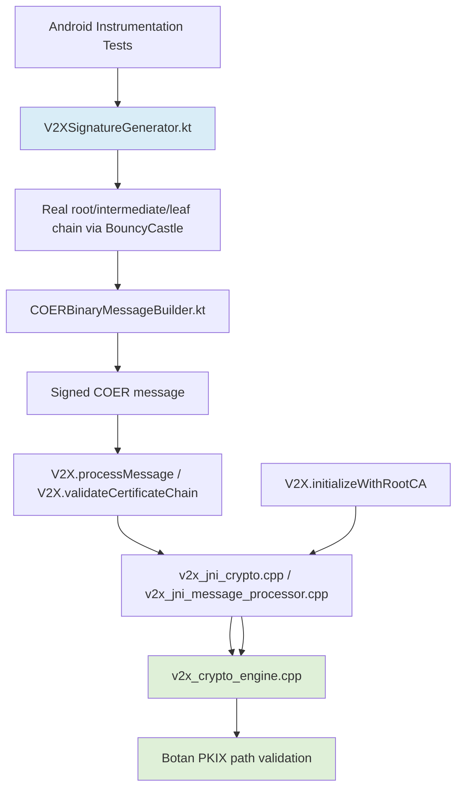
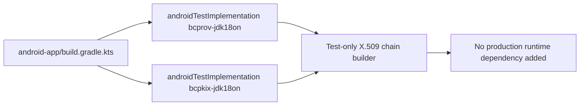
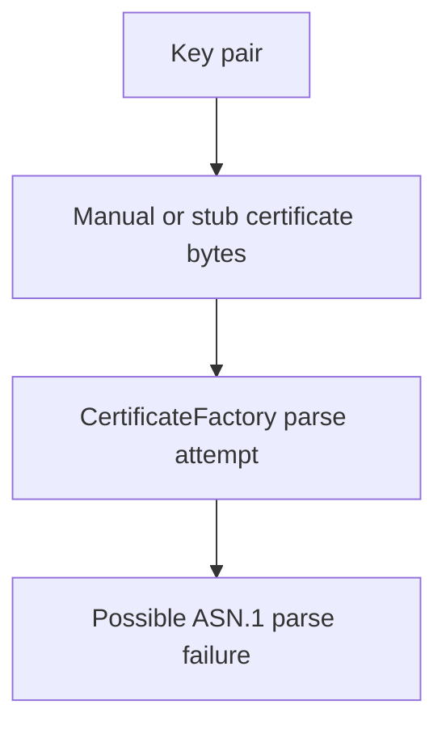
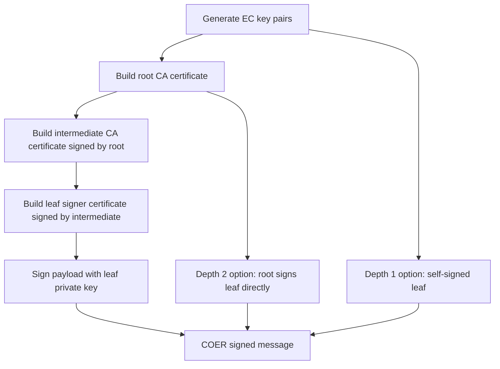
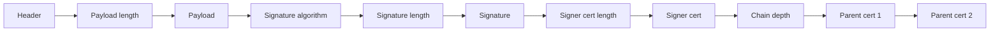
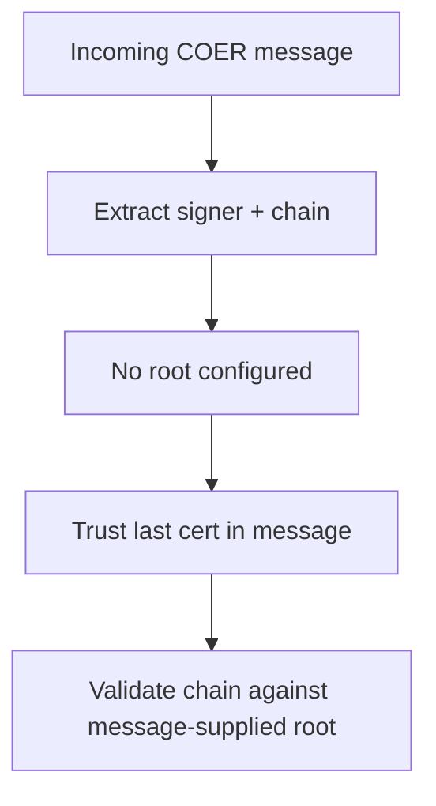
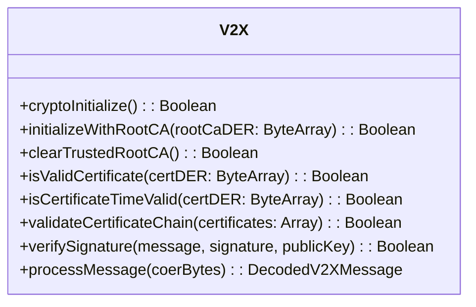
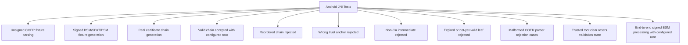
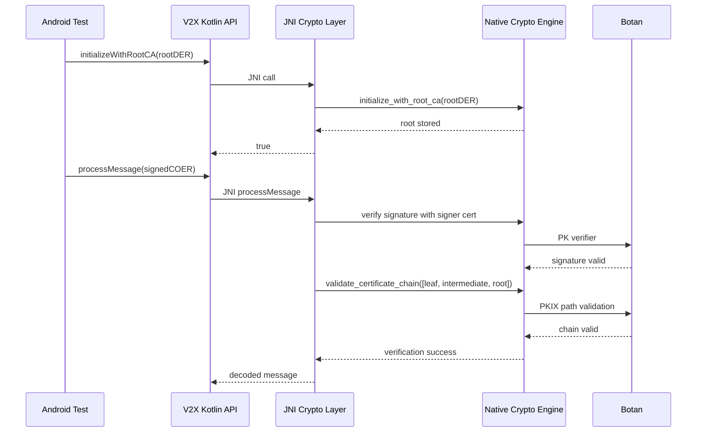

# V2X Crypto And Certificate Chain Handoff

**Status:** Certificate-chain hardening complete; Phase 1C malformation coverage complete; Phase 1D extension complete; Phase 1E wrap-up complete
**Last Verified:** `:android-app:connectedDebugAndroidTest` passed with 67 tests
**Scope:** Android test fixtures, JNI crypto surface, native Botan certificate validation, explicit trust-anchor handling

**Related Plan:** See [`docs/OPTION-1-DIGITAL-TWIN-PLAN.md`](./OPTION-1-DIGITAL-TWIN-PLAN.md) for the original design-phase plan this implementation evolved from.

---

## Why This Document Exists

This document captures the certificate, signature, and trust-model work completed during the recent hardening pass so the next session can continue without reconstructing the design history from code diffs.

It covers:
- what changed
- why it changed
- how the current end-to-end flow works
- where the trust anchor now enters the system
- what tests prove today
- what is still intentionally deferred

---

## Final Phase 1 Baseline

Phase 1 is now complete with the following verified baseline:
- 67 Android instrumentation tests passing
- valid unsigned BSM, SPaT, and PSM fixture coverage
- valid signed BSM end-to-end processMessage(...) coverage
- grouped malformed fixture rejection coverage
- grouped Phase 1D orchestration and stability coverage
- end-to-end negative signed-message rejection for trust-anchor, CA-policy, time-validity, and leaf-policy failures

### Final Success Criteria

| Capability | Evidence | Result |
| --- | --- | --- |
| Real test certificate chains | BouncyCastle-issued root/intermediate/leaf fixtures | Complete |
| Native chain validation | Botan PKIX path validation plus serialized chain-order checks | Complete |
| Trust-anchor enforcement | Explicit root required; message-supplied root no longer trusted | Complete |
| Leaf signer policy | Non-CA plus digitalSignature key usage enforced | Complete |
| End-to-end signed message verification | JNI processMessage(...) fails closed before marshalling | Complete |
| Parser robustness | Malformed COER catalogs reject without crashes | Complete |

---

## Summary Of What Was Fixed

### Initial State

The earlier test implementation had several compromises:
- test certificates were hand-built or stubbed and could fail ASN.1 parsing
- multi-certificate "chains" were not real issuer-signed chains
- native certificate-chain validation only checked whether certificates parsed
- native validation trusted the last certificate in the message when no root CA was configured
- public API naming implied more certificate validation than was actually performed

### Current State

The current implementation now does all of the following:
- builds real X.509 certificate chains in Android instrumentation tests using BouncyCastle
- emits signer certificate plus parent chain in COER message order expected by native code
- validates certificate chains in native code using Botan PKIX path validation
- rejects reordered certificate chains based on explicit serialized-order checks
- requires an explicitly configured trusted root CA for chain validation
- exposes `initializeWithRootCA(...)` and `clearTrustedRootCA()` through JNI/Kotlin
- clarifies that `isValidCertificate(...)` only checks the certificate validity window
- enforces leaf signer policy: non-CA leaf plus required `digitalSignature` key usage
- explicitly rejects wrong trust anchor, non-CA intermediate, expired leaf, and not-yet-valid leaf test chains
- adds parser-breaking malformed COER fixtures for truncation, invalid varints, bad headers, length overclaims, signed-container corruption, grouped malformed fixture catalogs, and Phase 1D grouped and end-to-end signed-message execution coverage

---

## Implementation Map



---

## Files Touched

### Android test fixture generation
- `android-app/src/androidTest/kotlin/com/sentinel/v2x/COERBinaryMessageBuilder.kt`
- `android-app/src/androidTest/kotlin/com/sentinel/v2x/V2XSignatureGenerator.kt`
- `android-app/src/androidTest/kotlin/com/sentinel/v2x/V2XJNITest.kt`
- `docs/TEST-VECTORS.md`

### Android module configuration
- `android-app/build.gradle.kts`

### Kotlin API surface
- `android-app/src/main/kotlin/com/sentinel/v2x/V2X.kt`

### Native crypto and JNI
- `native-engine/include/v2x_crypto_engine.h`
- `native-engine/src/v2x_crypto_engine.cpp`
- `native-engine/src/v2x_jni_crypto.cpp`
- `native-engine/src/v2x_message_processor.cpp`

---

## Dependency Changes

### Android test-only crypto dependency

BouncyCastle was added only to the Android instrumentation test source set.



### Packaging fix

Because BouncyCastle jars contain duplicate `META-INF/versions/9/OSGI-INF/MANIFEST.MF`, the Android module now excludes that resource during packaging.

---

## Certificate Generation Design

### Before



Problems:
- invalid DER in fallback path
- EC keys mixed with unrelated certificate structure
- no meaningful chain semantics

### After



### Chain semantics by depth

- `depth = 1`
  - self-signed leaf signer
  - used for basic signed-message tests
- `depth = 2`
  - root CA -> leaf signer
- `depth = 3`
  - root CA -> intermediate CA -> leaf signer

### Serialized COER layout



Important current rule:
- `issuerCert` in the COER message carries the signing certificate
- `chainCerts` carry the parent chain in leaf-to-root order

That matches how the native verifier uses the certificate to verify the payload signature first, then validates the certificate chain separately.

---

## Native Validation Evolution

### Stage 1: Parse-only chain validation

Original behavior in native code:
- parse each DER certificate
- return success if all parse

This meant:
- invalid issuer relationships could pass
- unordered chains could pass
- message-supplied root could become trusted implicitly

### Stage 2: Real Botan PKIX validation

Native validation now does:
- parse all certificates
- require explicit trusted root configuration
- require serialized issuer/subject chain order to be correct
- require parent certificates in the provided chain to be CA certificates
- require the final chain certificate to match the configured trust anchor
- run Botan `x509_path_validate(...)`

```mermaid
flowchart TD
    A[validate_certificate_chain(chain)] --> B[Parse DER certificates]
    B --> C{Trusted root configured?}
    C -- No --> D[Fail closed]
    C -- Yes --> E[Check issuer/subject order]
    E --> F[Check parent certs are CA]
    F --> G[Check final cert equals configured root]
    G --> H[Botan x509_path_validate]
    H --> I{Validation successful?}
    I -- No --> J[Reject chain]
    I -- Yes --> K[Accept chain]
```

---

## Trust Model Change

### Previous trust behavior



This was a major compromise because the sender effectively supplied its own trust anchor.

### Current trust behavior

```mermaid
flowchart TD
    A[V2X.initializeWithRootCA(rootDER)] --> B[JNI singleton crypto engine]
    B --> C[Native global trusted root state]
    C --> D[New V2XCryptoEngine instances pick up configured root]

    E[Incoming COER signed message] --> F[Extract signer + chain]
    F --> G[validate_certificate_chain]
    D --> G
    G --> H{Root configured?}
    H -- No --> I[Reject]
    H -- Yes --> J[Validate against configured root]
```

### Why the root is currently process-global

The current JNI surface uses a singleton crypto engine for direct crypto operations, while `V2XMessageProcessor` constructs fresh `V2XCryptoEngine` instances internally. To make end-to-end `processMessage(...)` use the same trust anchor without a broader refactor, the configured root is shared across engine instances in native code.

This is acceptable for now but still a design tradeoff. See deferred work below.

---

## Deferred PKI And Runtime Hardening

These are the main items intentionally left beyond the Phase 1 boundary:
- revocation handling and policy for offline vs online trust decisions
- stronger certificate-profile / EKU enforcement for production signer certificates
- replacing process-global trust-anchor state with scoped ownership
- structured native/JNI error taxonomy instead of string-only failure reporting
- broader semantic payload validation beyond parser-compatible fixture handling

These are not blockers for the current Phase 1 JNI validation goal, but they are the next security and productization steps.

---

## Public API Surface Now Available

### Kotlin API



### Important semantic note

`isValidCertificate(certDER)` currently means:
- certificate parses
- current time is between `notBefore` and `notAfter`

It does **not** mean:
- chains to trusted root
- revocation checked
- production policy approved

`isCertificateTimeValid(certDER)` was added as a Kotlin alias to make this clearer for future callers.

---

## Test Coverage Added

### What is explicitly tested now



### Phase 1D extension status

Phase 1D now also verifies:
- JNI `processMessage(...)` fails closed unless native verification succeeds
- end-to-end signed-message rejection for wrong trusted root, non-CA intermediate, expired leaf, not-yet-valid leaf, and leaf key-usage policy failures
- native signer verification uses the public key extracted from the X.509 certificate
- Botan verification uses explicit `DER_SEQUENCE` for Java ECDSA signatures and `IEEE_1363` for raw 64-byte signatures

### Phase 1D grouped execution status

Phase 1D additions now also verify:
- grouped valid unsigned fixtures execute through frame detection with BSM still exercised end to end via `processMessage(...)`
- grouped valid signed fixtures execute through frame detection with signed BSM still exercised end to end via `processMessage(...)`
- grouped malformed fixture catalogs are rejected systematically through `processMessage(...)`
- repeated valid BSM batch execution remains stable through `processBatch(...)`

### Current green path

Most important passing checks:
- valid generated root/intermediate/leaf chain validates only after root initialization
- reordered chain is rejected
- wrong trust anchor is rejected even for an otherwise valid chain
- non-CA intermediate is rejected
- CA leaf and missing `digitalSignature` leaf usage are rejected
- expired and not-yet-valid leaf certificates are rejected
- malformed COER inputs are rejected across truncation, bad-version, bad-varint, length-overclaim, and signed-container corruption cases
- clearing trusted root makes the same chain fail afterward
- signed BSM end-to-end processing works when the proper trusted root is installed

### Test count checkpoint

Latest verified checkpoint:
- `67` Android instrumentation tests passing on `Sentinel_Car(AVD) - 14`

---

## Current Validation Flow



---

## Remaining Deferred Work

These are not regressions. They are the next meaningful hardening steps.

### 1. Trust state ownership

Current compromise still present:
- trusted root CA is process-global native state
- this was chosen to make existing JNI and message-processor flows share trust without a larger architectural refactor

Potential next step:
- move trust state into a long-lived engine/processor instance instead of global shared state
- or define explicit session-scoped crypto context APIs

### 2. Leaf usage / policy enforcement

Current behavior:
- chain validity and CA structure are enforced
- leaf usage is still validated with Botan `Usage_Type::UNSPECIFIED`

Potential next step:
- add explicit signer policy checks for the leaf certificate
- enforce `digitalSignature` and reject CA leafs more directly if desired
- add EKU/profile logic if the project adopts a production PKI profile

### 3. Revocation handling

Current behavior:
- no CRL/OCSP requirement

Potential next step:
- define revocation strategy
- decide online/offline behavior
- decide hard-fail vs soft-fail policy

### 4. API cleanup

Current compatibility choice:
- `isValidCertificate(...)` kept for backward compatibility
- semantics clarified in docs and alias added

Potential next step:
- rename callers over time toward `isCertificateTimeValid(...)`

---

## Recommended Next Session Entry Points

If continuing from here later, the safest order is:

1. Move to Phase 1E documentation and final success-criteria wrap-up now that the Phase 1D extension is verified.
2. Add end-to-end negative signed-message tests that exercise the same rejected-chain cases through `processMessage(...)`.
3. Decide whether trust-root state should remain global or become scoped.
4. Decide whether leaf policy should also enforce EKU or a V2X-specific certificate profile.
5. Plan revocation strategy as a separate production-readiness task.

---

## Quick Resume Checklist

When resuming this work later, verify these first:
- BouncyCastle is still test-only in `android-app/build.gradle.kts`
- `connectedAndroidTest` still passes
- `V2XSignatureGenerator.kt` still emits signer cert first and parents in leaf-to-root order
- native `validate_certificate_chain()` still fails closed without configured root
- reordered chain rejection test still exists and passes
- wrong-trust-anchor and non-CA-intermediate rejection tests still exist and pass
- expired and not-yet-valid leaf rejection tests still exist and pass
- malformed COER rejection tests still exist and pass
- trusted root clear/reset test still exists and passes

---

## Suggested Commands For Future Verification

```bash
./gradlew :android-app:connectedAndroidTest
./gradlew :android-app:compileDebugAndroidTestKotlin
```

If trust-related work changes again, recheck these tests first:
- valid generated chain accepted
- reordered chain rejected
- wrong trusted root rejected
- non-CA intermediate rejected
- expired/not-yet-valid leaf rejected
- malformed COER truncation/varint/header/length-overclaim cases rejected
- clear trusted root resets validation state
- signed BSM processing through JNI
