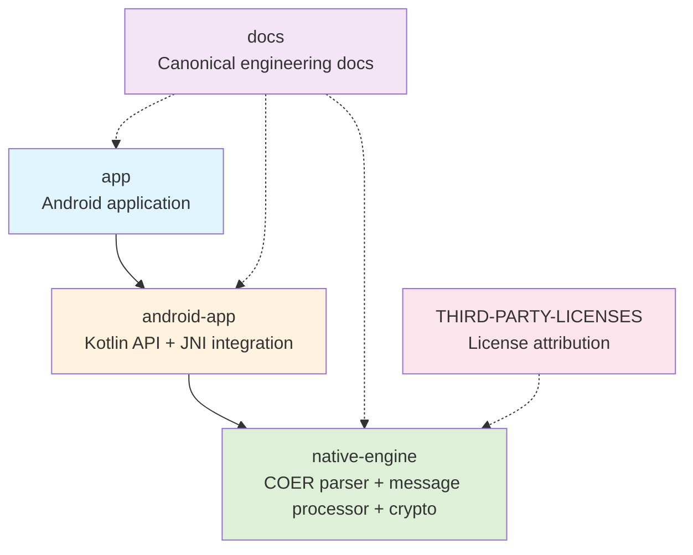
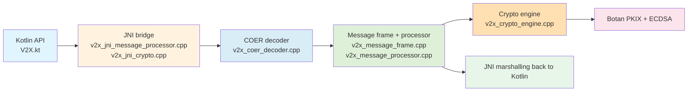
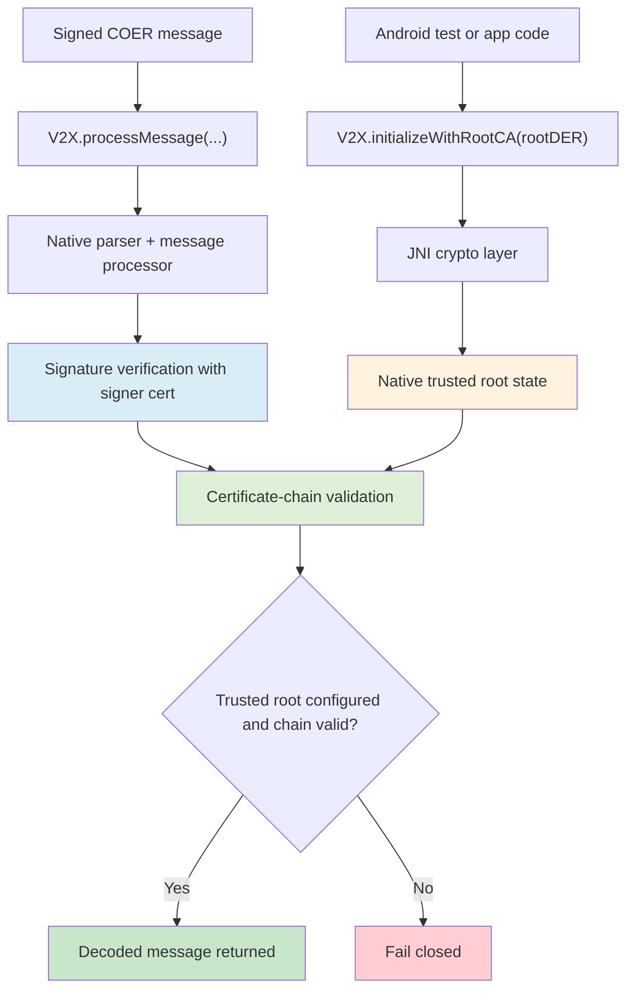

# Architecture

## Overview

The repository is organized around an Android-facing V2X bridge backed by JNI and a native C++ engine. The Android side provides the Kotlin API and instrumentation tests, while the native side performs COER parsing, message processing, and cryptographic verification.

Related design views:
- [High-Level Design](high-level-design.md) for design intent and tradeoffs
- [Low-Level Design](low-level-design.md) for binary layout and JNI/native details
- [Implementation Status](implementation-status.md) for the current validated baseline

The current validated path emphasizes:
- parser-compatible COER fixture generation on Android
- JNI-based message processing and crypto validation
- native Botan-backed certificate and signature verification
- deterministic Android instrumentation coverage for valid, invalid, and malformed message flows

## Repository Structure

Primary repository areas:
- `app/`: Android application module
- `android-app/`: Android library module that owns the active JNI integration path
- `native-engine/`: C++ engine for COER decoding, message processing, and crypto validation
- `docs/`: engineering documentation
- `THIRD-PARTY-LICENSES/`: third-party license attribution

Supporting structure notes:
- Android app packaging and JNI integration are separated into `app/` and `android-app/`
- native-engine development remains the deeper Linux/WSL-first path
- the docs tree is organized around a smaller canonical documentation set

## Module Boundaries

### Android application layer
The Android-facing API is exposed through `android-app/src/main/kotlin/com/sentinel/v2x/V2X.kt`. This is the boundary used by application code and instrumentation tests.

### JNI bridge layer
JNI entry points translate Kotlin and Java data into native types and route requests into the native engine. The main JNI sources are:
- `native-engine/src/v2x_jni_message_processor.cpp`
- `native-engine/src/v2x_jni_crypto.cpp`

### Native engine layer
The native engine contains:
- COER decoding
- `V2XFrameDecoder` frame detection and decode logic
- frame-layer exception handling owned by `V2XFrameDecoder` rather than the COER decoder
- message processing
- Botan-backed crypto and certificate validation

`COERDecoder`, `V2XFrameDecoder`, and `V2XMessageProcessor` are currently treated as stateless utility classes. They expose static entry points and do not own runtime session state between calls.

## Android To JNI To Native Flow

The dominant end-to-end flow is:
1. Kotlin calls `V2X.processMessage(...)`
2. JNI receives a `byte[]` payload and converts it to native data
3. native message processing parses the COER structure and, for signed messages, runs signature and certificate validation
4. JNI marshals the decoded message back into a Kotlin-side model only after validation succeeds

Related direct crypto flows include:
- `initializeWithRootCA(...)`
- `clearTrustedRootCA()`
- `validateCertificateChain(...)`
- `verifySignature(...)`

The active Android JNI surface is no longer the older `security-engine` path. The active library target is `v2x-jni`, and older references to `SecurityEngine` as the current Android integration should be treated as historical.

## COER Parsing Flow

The current parser-compatible message path is:
- `V2X.processMessage(...)`
- `v2x_jni_message_processor.cpp`
- `COERDecoder::parse()` in `native-engine/src/v2x_coer_decoder.cpp`
- `V2XFrameDecoder` frame detection and decode logic in `native-engine/src/v2x_message_frame.cpp`
- frame-layer exception types defined in `native-engine/include/v2x_frame_decoder.h`
- message processing and validation in `native-engine/src/v2x_message_processor.cpp`

This path expects a binary contract of:
- header byte
- varint payload length
- payload bytes
- optional signed-message trailer with algorithm, signature, signer certificate, and parent chain

Within this flow, `COERDecoder`, `V2XFrameDecoder`, and `V2XMessageProcessor` are used as stateless utility boundaries rather than instantiated service objects.

## Crypto And Trust Flow

Signed-message verification uses:
- signer public key extracted from the X.509 certificate
- Botan ECDSA verification with explicit DER support for Java-generated signatures
- Botan PKIX path validation for certificate chains
- explicit trusted-root configuration through Kotlin/JNI

Native validation now fails closed when:
- no trusted root is configured
- chain order is wrong
- intermediate CA structure is invalid
- leaf certificate policy or time validity is invalid

## Key Runtime Dependencies

Current important runtime and build-time dependencies:
- Android SDK / NDK for Android build and JNI integration
- Botan for native cryptography and PKIX validation
- BouncyCastle in Android instrumentation tests only, for deterministic certificate generation

The BouncyCastle dependency is intentionally scoped to tests and not part of the production Android runtime path.

## Diagrams

Conceptual architecture layers:
- Kotlin API layer
- JNI bridge layer
- native parser and message-processing layer
- native crypto and trust-validation layer

A useful mental model is:
- Kotlin initiates processing
- JNI marshals byte arrays and objects
- native code parses and validates
- decoded objects are returned only after the native path accepts the input

The earlier architecture support docs also highlighted a practical deployment split that still matters:
- Linux/WSL is the most reliable environment for full native development and native tests
- Android is the most relevant environment for JNI integration validation
- full native crypto capability exists in the repository, but Android validation is intentionally focused on the verified JNI path rather than every possible packaging combination

### Repository Architecture

### Android To Native Processing Flow

### Signed Message Trust Flow

## Current Architectural Constraints

Current architectural constraints include:
- parser-compatible fixture generation is prioritized over standards-faithful semantic encoding
- full semantic payload validation is not yet implemented
- trust-anchor state is currently shared across native engine instances to support the existing `processMessage(...)` architecture
- end-to-end coverage is strongest for BSM; SPaT and PSM remain more frame-detection oriented
- documentation is still mid-consolidation into a smaller canonical set
