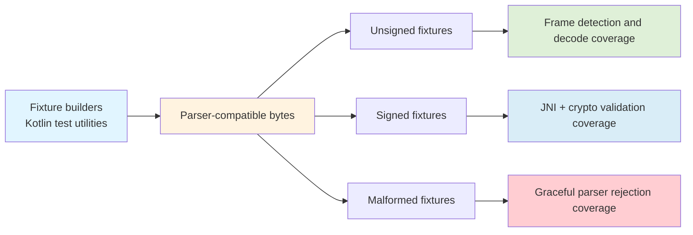
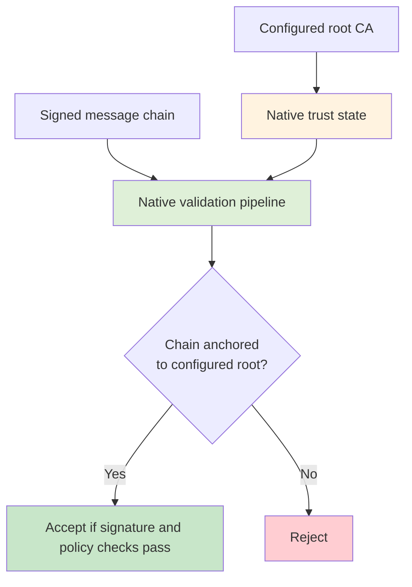
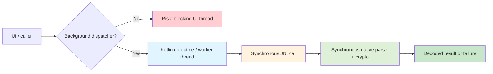

# High-Level Design

## Purpose And Scope

This branch adds parser-compatible synthetic V2X fixtures and JNI/native hardening for the Android V2X bridge. The focus is on exercising the implementation the app actually runs, rather than generating fully standards-faithful IEEE 1609.2 or J2735 payloads.

Related docs:
- [Architecture](architecture.md) for system structure
- [Low-Level Design](low-level-design.md) for implementation mechanics
- [Limitations and Deviations](limitations-and-deviations.md) for deferred work and standards gaps

## Design Goals

- Improve parser-frame coverage with deterministic synthetic fixtures
- Cover valid unsigned and signed message paths through Android instrumentation tests
- Strengthen certificate-chain and trust-anchor validation through JNI and native Botan validation
- Add malformed-input coverage that fails gracefully instead of crashing
- Keep test fixtures close to the current native parser contract

## Non-Goals

- Full semantic modeling of BSM, SPaT, or PSM payload contents
- Full standards-faithful ASN.1 message generation
- Production revocation handling or full PKI policy enforcement
- Broad cross-platform runtime packaging changes outside the Android/JNI validation path

## Threat Model Assumptions

The current design is aimed at reducing a practical subset of V2X message threats:
- forged messages from untrusted senders
- in-transit message tampering
- invalid or mis-issued certificate chains
- stale certificates outside their validity windows
- accidental trust in sender-supplied roots

Current mitigations in the branch include:
- ECDSA signature verification
- explicit trust-anchor configuration
- certificate-chain order and CA-constraint validation
- time-validity checks for certificates
- fail-closed behavior for malformed signed-message inputs

Threats not fully addressed yet include:
- revocation-aware trust decisions
- richer certificate policy and EKU enforcement
- broader operational key-management policy
- side-channel and hardware-backed trust guarantees beyond what underlying platform libraries may provide

## Parser-Compatible Fixture Strategy

The fixture strategy is intentionally parser-compatible rather than standards-complete:
- Kotlin builders emit byte arrays that match the native parser's current binary contract
- Unsigned fixtures cover BSM, SPaT, and PSM frame types
- Signed fixtures reuse the same parser-compatible payload style and append signature and certificate material in the order the JNI/native path expects
- Malformed fixtures mutate header, varint, payload, signature, and certificate boundaries to exercise parser rejection paths

## Signed Message Validation Strategy

Signed-message validation is exercised at two layers:
- direct certificate and signature JNI validation for focused crypto-policy tests
- end-to-end `V2X.processMessage(...)` coverage for signed BSM processing and failure-path hardening

The signed-message strategy now assumes:
- signer certificate serialized first
- parent chain serialized in leaf-to-root order
- native signature verification runs before JNI marshalling returns a decoded object

## Trust-Anchor Strategy

The trust model is explicit:
- tests initialize a trusted root through `V2X.initializeWithRootCA(...)`
- native validation fails closed when no trusted root is configured
- the last certificate in a message is no longer treated as an implicit trust anchor

This keeps trust decisions driven by configured policy rather than sender-supplied data.

## COER Strategy Decisions

The design uses a minimal binary contract that mirrors the current parser implementation:
- one-byte header
- varint payload length
- payload bytes
- optional signed-message trailer containing signature algorithm, signature, signer certificate, chain depth, and chain certificates

This is sufficient to validate parser behavior, JNI integration, and crypto enforcement without introducing full semantic encoding complexity.

## Major Design Tradeoffs

- Parser compatibility was prioritized over standards-faithful payload generation
- Trust-anchor state is currently shared across native engine instances to align existing JNI flows without a larger refactor
- SPaT and PSM are best validated through frame detection today; full end-to-end marshalling emphasis remains strongest for BSM
- Test-only BouncyCastle dependencies are used for certificate generation, while production validation remains in Botan

## Concurrency And Threading Model

The current design assumes JNI and native crypto calls are synchronous.

Architectural expectations:
- Kotlin callers should treat `processMessage(...)`, certificate validation, and signature verification as blocking work
- application code should dispatch these calls off the UI thread when integrating them into user-facing flows
- instrumentation tests can call the APIs directly because they are not UI-thread sensitive
- native Botan operations are currently executed inline within the calling thread

Design implications:
- Kotlin coroutine usage should prefer an IO or background dispatcher for message processing at runtime
- `processMessage(...)` should not be used directly from the UI thread for high-frequency traffic
- the current process-global trust-anchor state means trust configuration should be treated as shared mutable runtime state, not thread-local context

This model is acceptable for the current validation-oriented implementation, but a future productionized architecture should define explicit threading and context ownership more rigorously.

## Design Decisions

| Decision | Why | Consequence | Deferred Alternative |
| --- | --- | --- | --- |
| Use parser-compatible synthetic fixtures instead of standards-faithful payload generation | The immediate goal is to validate the active JNI/native parser path with deterministic inputs | Coverage is strongest for parser behavior and integration correctness, not full domain semantics | Add standards-faithful or semantically rich fixture generation in a later phase |
| Keep signed-message validation in the native layer with Botan | Crypto-policy enforcement should match the app-facing native execution path | Android tests depend on JNI/native correctness rather than Kotlin-only trust logic | Move some checks higher only if native enforcement remains authoritative |
| Require explicit trusted-root initialization | Sender-supplied roots should not drive trust decisions | Signed-message processing fails closed until trust state is configured | Introduce scoped trust stores or per-session trust contexts |
| Use BouncyCastle only in Android instrumentation tests | Test certificate generation needs deterministic issuer-signed chains without changing the production runtime crypto stack | Test and production crypto stacks differ by design | Replace with pre-generated fixtures only if maintainability improves |
| Keep trust-anchor state process-global for the current design | It fits the existing JNI/native architecture with minimal refactoring | Trust configuration is shared mutable state and not ideal for concurrent multi-context use | Refactor to engine-owned or session-owned trust state |
| Accept parser-compatible payloads while validating DER-tagged payloads conditionally | The current fixture contract and parser behavior must remain testable without pretending all payloads are DER-wrapped | Some payload validation is intentionally narrower than a strict standards interpretation | Introduce stricter semantic and encoding validation when payload modeling matures |
## Future Design Directions

The next design-level expansions are:
- semantic validation of BSM, SPaT, and PSM payload fields
- scoped trust-state ownership instead of process-global root state
- stronger production certificate-profile and EKU enforcement
- revocation strategy and failure policy
- future COER evolution should be judged pragmatically: a custom parser remains attractive for auditability and limited scope, but a third-party library is only justified if it materially improves maintainability without weakening control over security-critical parsing behavior

## Glossary

- `BSM`: Basic Safety Message
- `SPaT`: Signal Phase and Timing
- `PSM`: Personal Safety Message
- `COER`: Canonical Octet Encoding Rules
- `PKIX`: Public Key Infrastructure X.509 path-validation model
- `Trust anchor`: Configured root certificate used as the basis for path validation
- `DER_SEQUENCE`: ASN.1 DER-encoded ECDSA signature format used by Java `SHA256withECDSA`
- `IEEE_1363`: Fixed-width raw signature format often represented as `r || s`
