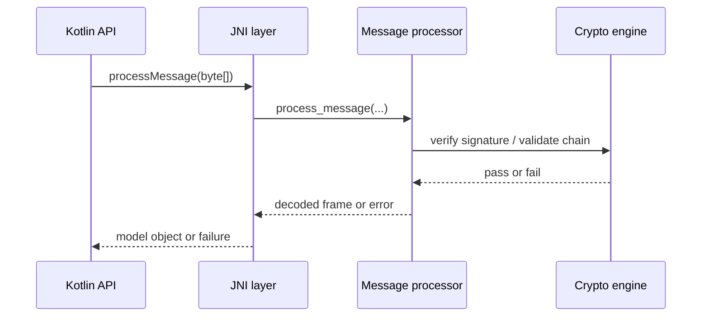
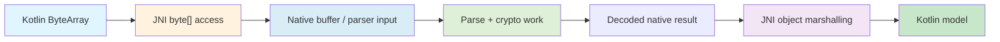
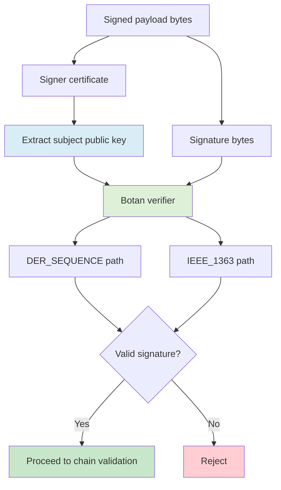

# Low-Level Design

## Binary Message Contract

The current parser-compatible binary contract is:
- `1 byte` header
- `varint` payload length
- `payload`
- if signed:
  - `1 byte` signature algorithm
  - `varint` signature length
  - `signature`
  - `varint` signer certificate length
  - `signer certificate`
  - optional `1 byte` chain depth
  - repeated `varint + cert bytes` for parent chain certificates

Related docs:
- [Architecture](architecture.md) for the runtime module view
- [High-Level Design](high-level-design.md) for design rationale
- [Test Plan](test-plan.md) for fixture and validation coverage

## Header And Varint Encoding Rules

The test-side builders mirror the native parser contract exactly:
- header byte determines protocol/version and signed vs unsigned framing
- payload length uses the same varint rules the native parser expects
- malformation coverage includes truncated long-form varints, indefinite-length encodings, and length overclaims

## Signed Message Layout

Signed fixtures append a trailer after the payload:
1. signature algorithm byte
2. signature length varint
3. signature bytes
4. signer certificate length varint
5. signer certificate bytes
6. chain depth byte when chain certs are present
7. parent certificates in order

Java ECDSA signatures are DER-encoded, and the native verifier explicitly supports `DER_SEQUENCE` for these test-generated signatures.

## Certificate Chain Serialization Rules

Current chain semantics by depth:
- `depth = 1`: self-signed leaf signer for basic signed-message cases
- `depth = 2`: root CA -> leaf signer
- `depth = 3`: root CA -> intermediate CA -> leaf signer

Serialization rules:
- `issuerCert` carries the signing certificate
- `chainCerts` carry the parent chain in leaf-to-root order
- native validation checks serialized issuer/subject order before PKIX validation

## Key Kotlin Test Utilities

Primary test utilities:
- `COERBinaryMessageBuilder.kt` for unsigned and basic signed fixture assembly
- `V2XSignatureGenerator.kt` for EC key generation, certificate chains, and signed payload creation
- `COERMalformationGenerator.kt` for parser-breaking mutations and grouped malformed catalogs
- `V2XJNITest.kt` for grouped orchestration and end-to-end JNI coverage

## JNI Entry Points

Relevant Kotlin/JNI surface:
- `V2X.processMessage(...)`
- `V2X.processBatch(...)`
- `V2X.initializeWithRootCA(...)`
- `V2X.clearTrustedRootCA()`
- `V2X.validateCertificateChain(...)`
- `V2X.isValidCertificate(...)`
- `V2X.isCertificateTimeValid(...)`

The current JNI layer should be understood as the active V2X entry surface for Android validation. Historical minimal-JNI notes are useful context, but the current branch no longer describes the JNI path as only a trivial loader smoke test.

## Native Verification Pipeline

The effective native verification path is:
- JNI `processMessage(...)`
- `V2XMessageProcessor::process_message(...)`
- payload and message parsing through the COER decoder and message-frame logic
- signature verification using the signer certificate's public key
- certificate-chain validation against the configured trust anchor
- JNI marshalling only after verification succeeds

## Payload Validation Rules

Payload validation is conditional:
- parser-compatible synthetic payloads are accepted as-is
- DER-tagged payloads still go through DER validation

This keeps the current fixtures valid without weakening DER validation for payloads that actually claim to be DER-wrapped.

## Memory Marshalling Strategy

JNI byte-array handling is currently optimized for correctness and maintainability rather than extreme throughput tuning.

Current strategy:
- Kotlin `ByteArray` inputs are passed through JNI into native code as Java byte arrays
- JNI code converts those arrays into native buffers suitable for parser and crypto operations
- the implementation favors predictable marshaling over aggressive pinning semantics

Design guidance:
- `GetByteArrayElements` or equivalent safe byte-array access patterns are appropriate for the current workload and validation focus
- `GetPrimitiveArrayCritical` should be used cautiously because it can constrain GC behavior and is a poor fit for long-running native work such as parsing plus crypto verification
- for higher-frequency message processing, minimizing unnecessary copies and reusing native buffers becomes more important than in the current instrumentation-heavy path

This means the current implementation is acceptable for Phase 1 and Phase 2 validation work, but sustained high-rate production message processing may require a more explicit JNI memory and batching strategy.

## Performance Considerations

Useful performance assumptions carried forward from earlier design notes:
- typical parser and verification inputs are still expected to be relatively small message payloads rather than bulk data transfers
- one-time crypto initialization is preferable to repeated per-message initialization work
- repeated certificate-chain validation is a likely candidate for caching or reuse if message rates increase substantially
- copy-based JNI marshalling is acceptable for the current validation-oriented workload, but may need reevaluation for sustained high-frequency traffic

Current canonical docs do not claim hard production throughput numbers. Performance targets should be validated separately once semantic validation, runtime integration, and any future dashboard or service layers are in scope.

## Signature Verification Details

Important native crypto details:
- signer public key is extracted from the X.509 certificate, not loaded as a generic key blob
- Botan verification uses `DER_SEQUENCE` for Java-generated ECDSA signatures
- `IEEE_1363` remains relevant for raw 64-byte signature formats
- chain validation uses Botan PKIX path validation after explicit prechecks for order, CA constraints, and trust-anchor match

## Failure Handling Behavior

The implementation now fails closed for the key error classes tested in Phase 1:
- missing or wrong trusted root
- reordered chains
- non-CA intermediate
- invalid leaf policy
- expired or not-yet-valid leaf certificate
- malformed COER truncation and length corruption cases

## Implementation Notes

Current implementation notes that matter for maintainers:
- BouncyCastle is test-only and scoped to Android instrumentation tests
- Botan remains the native validation engine
- `isValidCertificate(...)` is a time-validity check, not a full trust decision
- trust state is currently shared across native engine instances to support the existing JNI and message-processor structure
