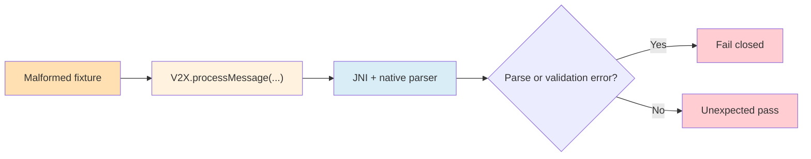

# Test Plan

## Test Objectives

The test plan validates parser compatibility, signed-message verification, malformed-input handling, and JNI/native integration behavior for the Android V2X bridge.

Related docs:
- [Low-Level Design](low-level-design.md) for binary and JNI mechanics
- [Implementation Status](implementation-status.md) for the latest validated baseline
- [Limitations and Deviations](limitations-and-deviations.md) for known testing and coverage gaps

## Test Scope

In scope:
- valid unsigned COER fixtures
- valid signed COER fixtures
- certificate-chain and trust-policy negative cases
- malformed COER parser rejection cases
- grouped fixture execution and basic stability coverage

## Out-Of-Scope Tests

Out of scope for this phase:
- field-level semantic validation for BSM, SPaT, and PSM
- revocation behavior
- performance, soak, or stress testing beyond basic grouped runs
- standards-complete payload generation

## Test Environments

Primary environment:
- Android instrumentation tests in `android-app`
- emulator baseline used during verification: `Sentinel_Car(AVD) - 14`

## How To Run Tests

Primary full-suite command:
```bash
bash gradlew :android-app:connectedDebugAndroidTest
```

Useful targeted commands:
```bash
bash gradlew :android-app:connectedDebugAndroidTest -Pandroid.testInstrumentationRunnerArguments.class=com.sentinel.v2x.V2XJNITest
bash gradlew :android-app:assembleDebugAndroidTest
```

## Fixture Categories

The fixtures are grouped into:
- valid unsigned fixtures
- valid signed fixtures
- direct crypto-policy negative fixtures
- malformed COER rejection fixtures
- grouped Phase 1D orchestration and stability flows

## Valid Unsigned Cases

Current valid unsigned fixtures:
- `unsigned-bsm`
- `unsigned-spat`
- `unsigned-psm`

Expected result: frame detection and decode succeed.

## Valid Signed Cases

```mermaid
flowchart LR
    A["Signed fixture"] --> B["Configure trusted root"]
    B --> C["V2X.processMessage(...)"]
    C --> D["JNI + native parser"]
    D --> E["Signature verification"]
    E --> F["Certificate-chain validation"]
    F --> G["Decoded message returned"]

    style A fill:#e1f5ff
    style C fill:#fff3e0
    style D fill:#d9edf7
    style E fill:#dff0d8
    style F fill:#dff0d8
    style G fill:#c8e6c9
```


Current valid signed fixtures:
- `signed-bsm-depth1`
- `signed-spat-depth1`
- `signed-psm-depth1`
- `signed-bsm-depth2`
- `signed-bsm-depth3`
- shared-chain signed BSM/SPaT/PSM fixtures used with configured root

Expected result: signed parsing succeeds, and signed BSM succeeds end to end through `processMessage()` when the correct root is configured.

## Negative Crypto Cases

Current crypto-policy negatives include:
- wrong trusted root
- reordered chain
- non-CA intermediate
- CA leaf
- missing `digitalSignature` key usage on leaf
- expired leaf
- not-yet-valid leaf
- trusted root cleared before revalidation

These run either through `validateCertificateChain()` or, for signed BSM flows, through end-to-end `processMessage()` rejection.

## Malformed COER Cases


Unsigned malformed rejection coverage includes:
- truncated header
- truncated payload
- indefinite-length varint
- oversized varint length-of-length
- truncated long-form varint
- unsupported protocol version
- unsupported frame type
- payload length overclaim

Signed malformed rejection coverage includes:
- missing signature algorithm byte
- signature length overclaim
- issuer certificate length overclaim
- truncated issuer certificate length varint
- chain certificate length overclaim
- truncated chain certificate length varint
- chain depth/count mismatch
- truncated signed container
- dangling chain depth byte

## Grouped Execution And Stability Tests

Phase 1D grouped coverage verifies:
- grouped valid unsigned fixture execution through `V2X.processMessage()`
- grouped valid signed fixture execution through `V2X.processMessage()` with a shared trusted root
- grouped malformed catalog rejection through `V2X.processMessage()`
- repeated valid unsigned batch execution through `V2X.processBatch()`
- 5 end-to-end negative signed-message rejection tests through full JNI/native processing:
  - wrong trust root
  - non-CA intermediate
  - expired leaf
  - not-yet-valid leaf
  - leaf policy violation

## Expected Results

Expected final Phase 1 results:
- valid fixtures succeed
- malformed fixtures fail gracefully
- invalid trust or certificate-policy cases fail closed
- `processMessage()` does not return decoded objects for rejected signed messages

## Coverage Summary

Current verified checkpoint:
- Phase 1A through Phase 1E complete
- `67` Android instrumentation tests passing
- parser, trust, malformed-input, and signed-message failure paths covered at the intended Phase 1 depth

## Remaining Test Gaps

The next meaningful test gaps are:
- semantic payload validation for BSM, SPaT, and PSM
- broader stress and soak behavior
- revocation-related scenarios
- richer error taxonomy assertions if the JNI/native API begins returning structured failures
